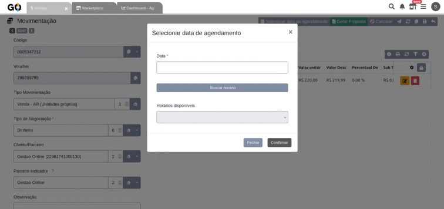
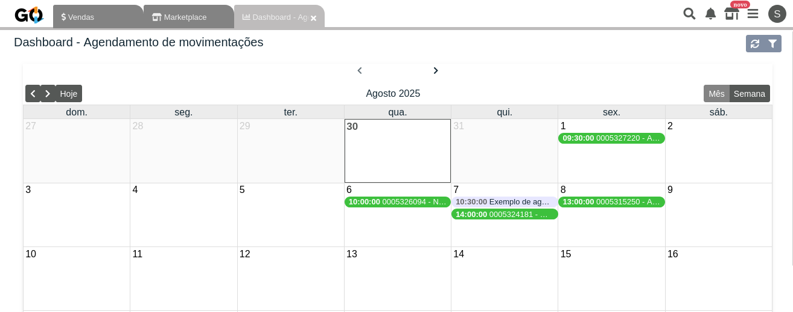

### Organize suas movimentações/vendas com mais controle, eficiência e praticidade!

| |
__
 | | 
|-|-|-|
|Agora ficou ainda mais fácil gerenciar seus atendimentos no Gestão Online. Com a nova extensão **Agendamento de Movimentações**, você pode programar o dia e o horário exatos em que irá realizar a entrega de seu produto/serviço com seu cliente. | | |

### Principais benefícios

| |
__
 | |
|-|-|-|
|**✅ Agendamentos personalizáveis** Defina horários de atendimento, intervalo entre agendamentos e número de atendentes disponíveis. | |**✅ Dashboard exclusivo** Visualize rapidamente todos os agendamentos do dia e acompanhe cada atendimento com clareza e organização.|
|**✅ Indicador de agendamento na venda** Cada venda com agendamento recebe um novo ícone de calendário na coluna de status, permitindo mais controle e visibilidade para sua equipe.| |**✅ Agendamentos avulsos** Crie lembretes para reuniões, compromissos ou qualquer atividade importante.|

 

Além da criação desses agendamentos de movimentações e avulsos, você vai contar também com todos os agendamentos criados via **Atendimento Express**, disponibilizados também no dashboard para você acompanhar, evitando conflitos entre as agendas de atendimento.

 

### O que muda no meu sistema?

Ao instalar no seu sistema e realizar as configurações necessárias, você verá que ao abrir uma venda, um novo botão ficará disponível no menu superior, permitindo, assim, criar o agendamento baseado na configuração que realizou na extensão (data e horários disponíveis). 

 

Você ainda terá acesso a um dashboard personalizado que permitirá acompanhar todos os agendamentos criados, tendo uma visão mais ampla de tudo o que foi criado no mês ou na semana, podendo também abrir os agendamentos e verificar suas descrições.

 

**Instale agora a extensão Agendamento de Movimentações no seu ERP Gestão Online e eleve a organização do seu atendimento ao próximo nível!**

