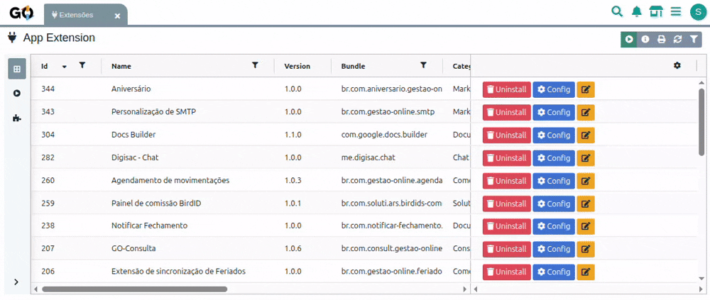
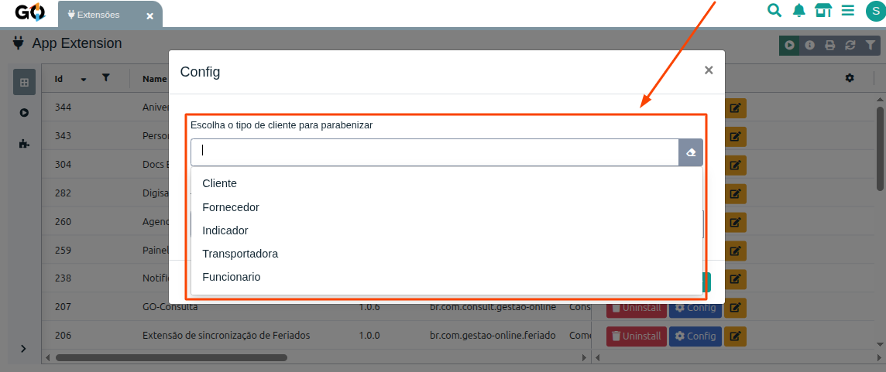
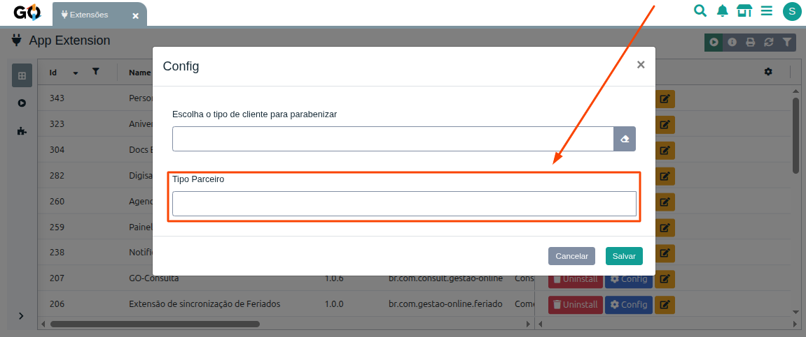

# Aniversário

A **Extensão Aniversário** é uma funcionalidade do **Gestão Online** que envia automaticamente **mensagens de feliz aniversário** para clientes, parceiros e colaboradores no dia de seu aniversário.
 
**Observação:**
É fundamental que o campo de **data de aniversário** esteja preenchido para que a extensão funcione corretamente.

## **Configuração da Extensão**

### **1. Acesso à Configuração**

Para configurar a extensão Aniversário:

     

 

1. Acesse o menu de **Extensões** no sistema  
2. Localize a extensão **Aniversário** 
3. Clique em **Configurar**

### **2. Campos de Configuração**

Na tela de configuração, você encontrará **dois campos principais**:

| Campos | Funções |
| -------------------------------------- | ------------------------------------------------------ |
| **Tipo Cliente** | Filtrar por cliente, Fornecedor, Indicador, Transportadora ou Funcionário |
| **Tipo Parceiro** | Filtrar por tipo de parceiro cadastrado na base da empresa. |
 

**Observação:**
É necessário preencher pelo menos **um dos campos** para que a extensão funcione corretamente.

#### **Tipo Cliente**

Permite selecionar um ou mais tipos de clientes que receberão a mensagem de aniversário.

     

#### **Tipo Parceiro**

Permite selecionar um ou mais tipos de parceiros que receberão a mensagem de aniversário.

     

<h4 style="margin: 0 0 10px; font-size: 1em;">⚠️ Importante:</h4>
Se ambos os campos forem selecionados, o destinatário deve atender aos dois critérios para receber a mensagem.

# Filtragem e Validação

* Apenas registros com **data de nascimento preenchida** receberão a mensagem.
* Pessoas jurídicas (clientes com CNPJ) **não recebem e-mails**.
* O sistema aplica os filtros configurados para garantir que apenas os destinatários corretos sejam contemplados.

# Email
Um e-mail no formato abaixo será enviado automaticamente ao cliente no dia de seu aniversário, contendo o nome do cliente e o nome da base:

     

