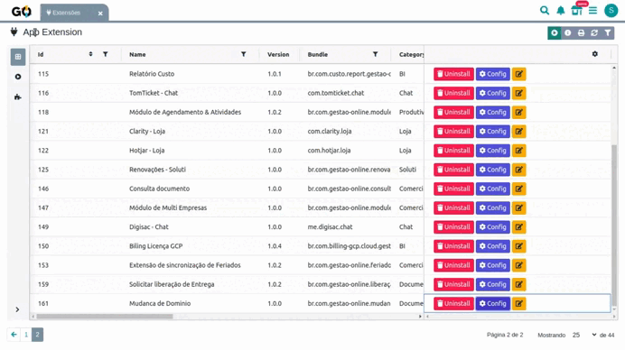

# **Mudanca de Dominio**

**Descrição:**  
A Mudança de Domínio é uma extensão do sistema Gestão Online que permite trocar o endereço web do seu sistema de forma simples e automática.
Você só precisa digitar o novo domínio desejado e a extensão cuida de todo o processo de migração automaticamente, preservando todos os seus dados e configurações.

**Como funciona a extensão**

A extensão trabalha de forma totalmente automática. Quando você informa o novo domínio, ela inicia o processo de migração em segundo plano, transferindo todos os dados, configurações and personalizações para o novo endereço.

## **Configuração da Extensão**

### **1\. Acesso à Configuração**

Para usar a extensão Mudança de Domínio:

  

 

1. Localize a extensão "Mudança de Domínio"
2. Acesse o menu de Extensões no sistema
3. Clique em Configurar

### **2\. Campos de Configuração**

Na tela que abrir, você verá um campo simples:

###  Insira o novo endereço 

  

 

### Insira o mome do responsável

Digite o nome do responsável para a configuração do domínio: Informe o nome completo da pessoa responsável pela migração

Este responsável será contactado durante o processo de configuração

  

 

###  Insira o  Email do Responsável

Digite o email do responsável para a alteração do domínio: Informe um email válido do responsável
Este email será usado para comunicações sobre o status da migração e confirmações importantes

  

 

 

