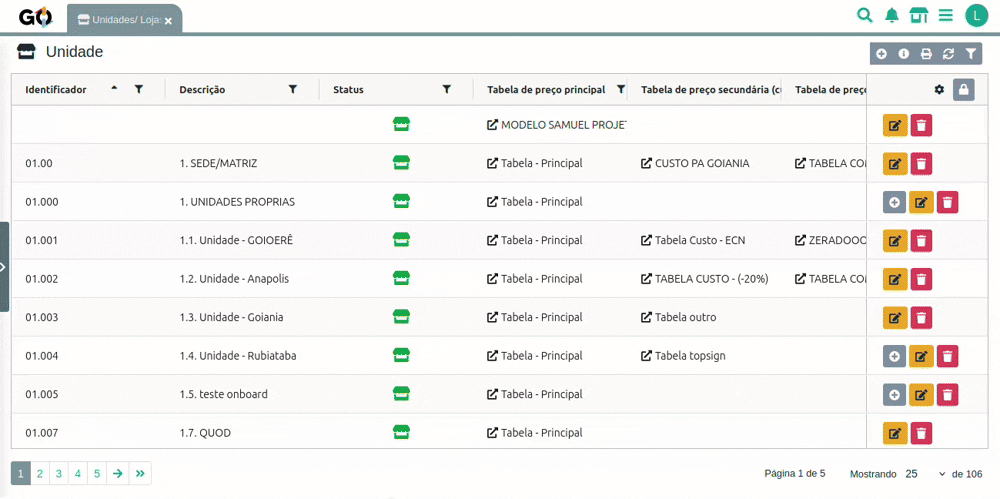

### Apresentamos a extensão **Notificar Fechamento**

| | |
|-|-|
| A extensão **Notificar Fechamento** é a solução do **Gestão Online** para **alertar automaticamente parceiros e coordenadores sobre novos fechamentos de contrato**.   Com ela, você garante que os responsáveis recebam notificações rápidas e precisas, acompanhando tudo dentro do sistema de forma integrada e segura. | 

 |

## Como Funciona na Prática

**Sempre que um fechamento de contrato é gerado, a extensão envia uma notificação automática para os usuários relevantes.**

O processo é simples:

1. **O sistema detecta um novo fechamento** no sistema.
2. **Verifica se a unidade possui parceiro responsável** e se existem coordenadores configurados para notificação.
3. **Gera uma notificação** contendo informações como código da venda e instruções.
4. **Envia a notificação** para:

   * Usuário parceiro da unidade (prioritário)
   * Coordenadores da unidade (se configurado na configuração da extensao)
5. **Registra automaticamente no histórico** da movimentação de fechamento o envio da notificação.
6. **Registra o IP** do usuário que leu a notificação no histórico, garantindo rastreabilidade e segurança.

**OBS**: Se algum usuário não for encontrado ou não estiver ativo, a notificicação nao vai funcionar.

     

 

## Segurança e Rastreamento

A extensão garante **registro confiável e histórico detalhado** de todas as notificações:

| Característica                               | Benefício                                                   |
| -------------------------------------------- | ----------------------------------------------------------- |
| **Notificação automática**                   | Garante que todos os envolvidos sejam informados sem falhas |
| **Registro de IP do usuário**                | Rastreamento de leitura da notificação                      |
| **Histórico completo**                       | Cada leitura fica registrada   |
| **Verificação de usuários ativos**           | Evita notificações para usuários inativos ou ausentes       |
| **Integração com os coordenadores** | Notificação segmentada de forma precisa                     |

 

### Benefícios para o Seu Negócio

**➤  Automatização Completa**  
Reduza processos manuais e garanta que todos recebam as informações de forma instantânea.

**➤  Acompanhamento Transparente**  
Controle total de quem recebeu a notificação e quem leu.

**➤  Registro Seguro**  
Histórico detalhado e IP do usuário garantem rastreabilidade completa.

**➤  Experiência Profissional**  
Envio de notificações integrado ao sistema, com visual moderno e informativo.

 

### Exemplo Prático de Uso

| | |
|-|-|
|  | Imagine que aconteceu um fechamento de contrato da sua unidade. Com a extensão **Notificar Fechamento**, o processo fica assim:  1. A extensão identifica automaticamente o fechamento do contrato 2. Notificação é enviada automaticamente ao parceiro da unidade 3. Coordenadores configurados também são notificados 4. Histórico registra envio e IP do acesso 5. Todos os envolvidos têm ciência imediata do fechamento  Isso garante rastreabilidade total. |

 

### Transforme Seu Fluxo de Fechamentos

A extensão **Notificar Fechamento**  torna a comunicação com parceiros responsáveis da unidade e coordenadores **rápida, segura e integrada** ao Gestão Online.

**Garanta que todos saibam do fechamento em tempo real e organize suas operações de forma profissional!**

