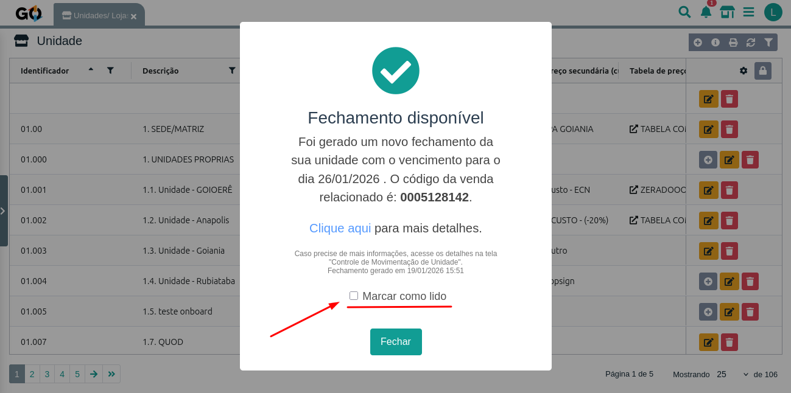
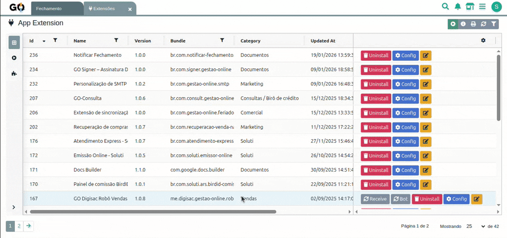
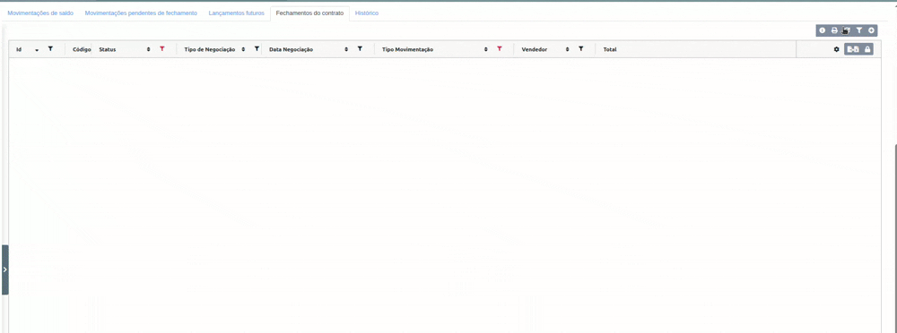
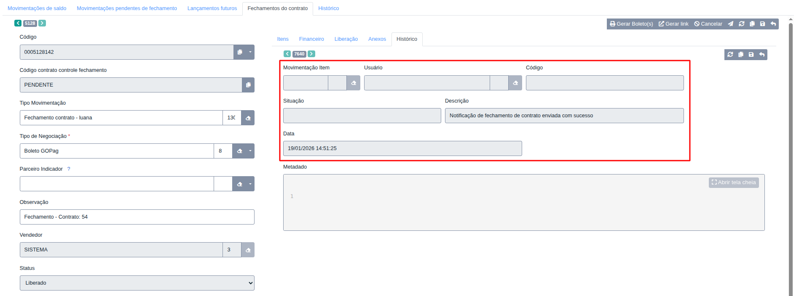
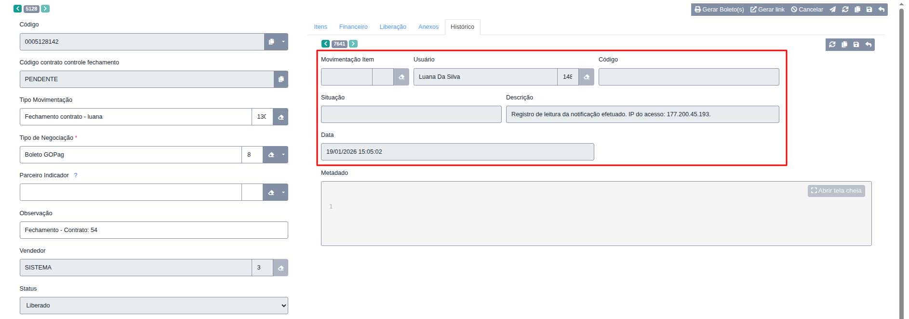

# Notificar Fechamento

A extensão **Notificar Fechamento** é responsável por **enviar notificações automáticas sempre que um fechamento de contrato é realizado**.

Essa extensão garante que **parceiros e coordenadores sejam informados em tempo real**, com total **rastreabilidade**, **histórico de envio** e **registro de leitura**, tudo de forma integrada e segura dentro do sistema.

## **Visão Geral da Notificação**

Sempre que um fechamento ocorre, o sistema gera automaticamente uma notificação contendo as informações do fechamento do contrato.

     

> O **"Clique aqui"** redireciona para o resumo do pedido de fechamento.

---

## **Configuração da Extensão**

### **1. Acesso à Configuração**

Para configurar a extensão **Notificar Fechamento**:

     

1. Acesse o menu **Extensões** no sistema
2. Localize a extensão **Notificar Fechamento**
3. Clique em **Configurar**

---

### **2. Campo de Configuração**

A extensão possui **uma configuração simples e objetiva**:

     

| Campo                       | Função                                                                                               |
| --------------------------- | ---------------------------------------------------------------------------------------------------- |
| **Notificar Coordenadores** | Define se os coordenadores da unidade também receberão a notificação de fechamento, além do parceiro |

* **Ativo** → Parceiro **e** coordenadores recebem a notificação
* **Inativo** → Apenas o **parceiro da unidade** será notificado

> ⚠️ A notificação só será enviada para usuários **ativos e devidamente cadastrados**.

---

# Fluxo de Notificação de Fechamento

O fluxo da extensão é totalmente automático e acontece no momento do fechamento do contrato.

     

### Funcionamento do Fluxo

1. A extensão **detecta um novo fechamento de contrato**
2. Verifica se a unidade possui **parceiro vinculado** e se esse parceiro possui um **usuário**
3. Verifica se há **coordenadores configurados para notificação**
4. A notificação é **gerada automaticamente**
5. A notificação é enviada para:

   * **Parceiro da unidade** (prioritário)
   * **Coordenadores** (se configurado)
6. O sistema gera um **histórico de envio** do fechamento

> ⚠️ É indispensável que a unidade possua um **responsável cadastrado corretamente**, com documento válido, e que exista um **usuário ativo** vinculado a esse responsável, utilizando o **mesmo documento** no cadastro.
---

## Histórico de Envio e Leitura

A extensão mantém um **histórico completo e detalhado**, garantindo rastreabilidade total.

### • Histórico de Envio

Assim que a notificação é enviada, o sistema registra automaticamente um **histórico de envio** na movimentação do fechamento.

     

---

### • Histórico de Leitura

Cada vez que um usuário acessa e lê a notificação:

* Um **novo registro de histórico** é gerado
* O **IP do usuário** é armazenado
* O usuário que leu é registrado
* A data e hora da leitura ficam registradas

     

> Caso mais de um usuário leia a notificação, **vários registros de leitura** serão criados, um para cada acesso.

---

## Segurança e Rastreabilidade

A extensão **Notificar Fechamento** garante controle e transparência em todo o processo:

| Característica                     | Benefício                                      |
| ---------------------------------- | ---------------------------------------------- |
| **Envio automático**               | Garante o envio do aviso de fechamento de forma automática |
| **Histórico de envio**             | Confirma que a notificação foi disparada       |
| **Histórico de leitura**           | Permite saber exatamente quem leu              |
| **Registro de IP**                 | Aumenta a segurança e a rastreabilidade        |
| **Verificação de usuários ativos** | Evita notificações inválidas                   |

