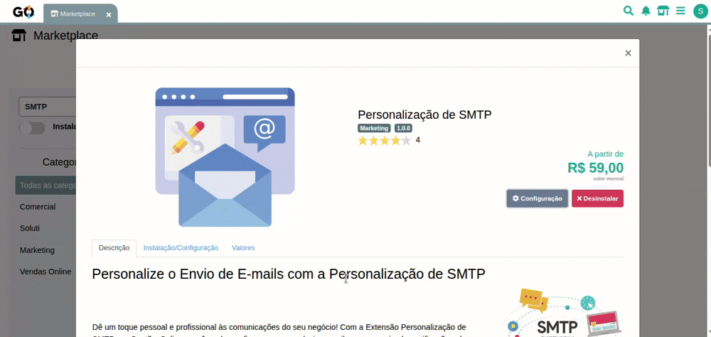
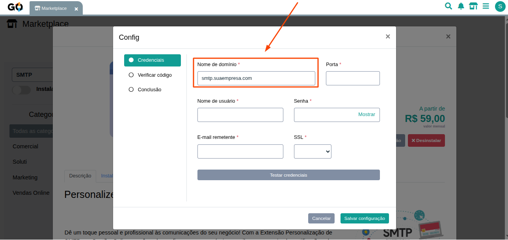
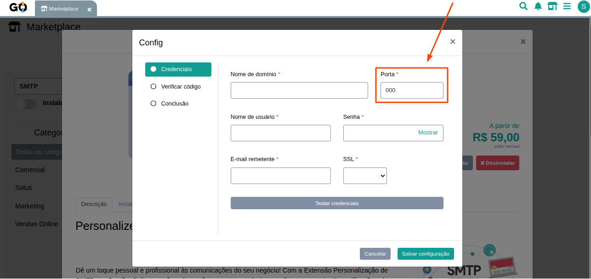
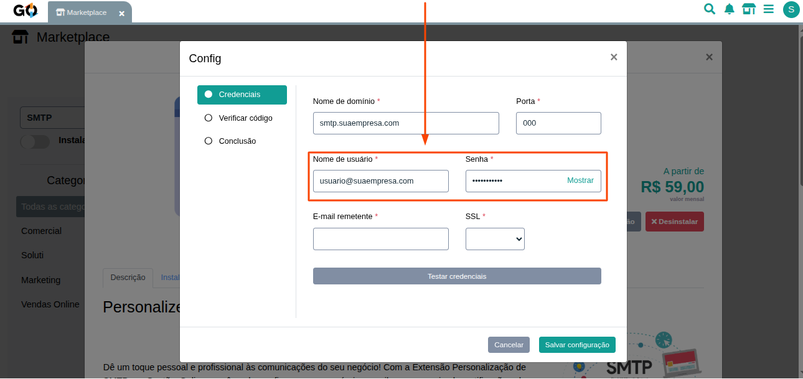
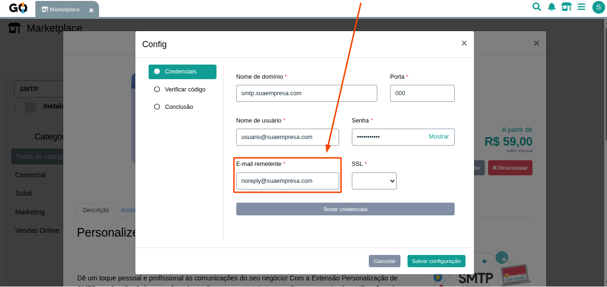
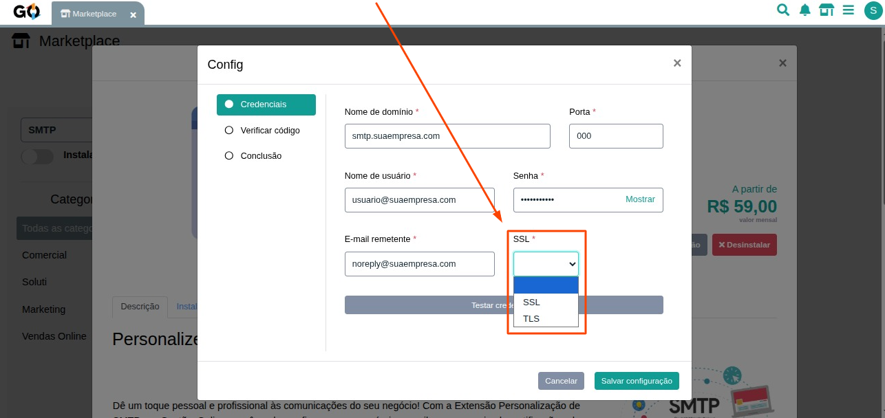
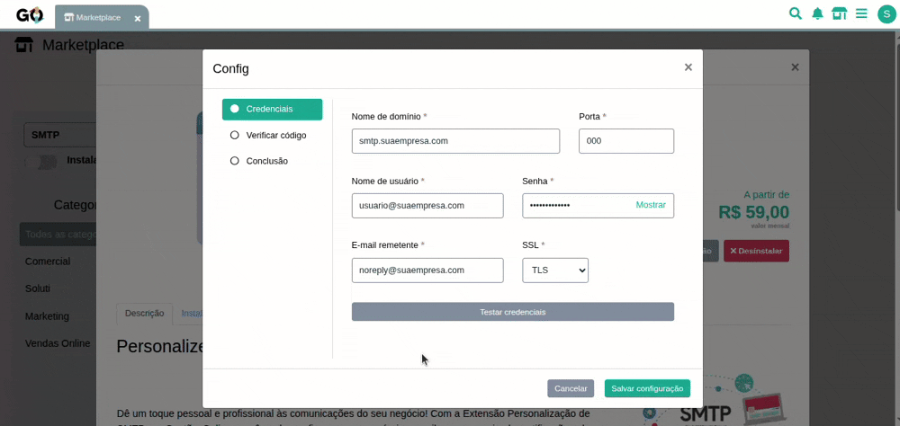
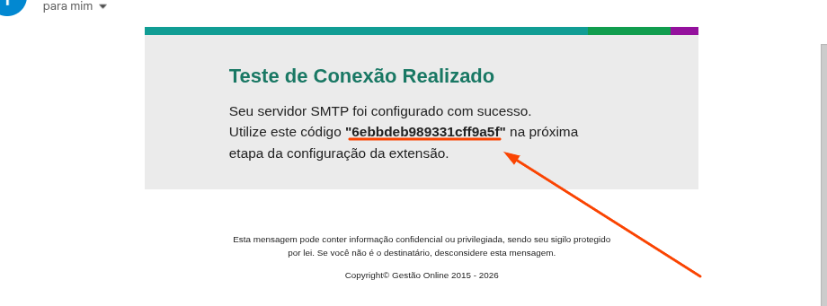
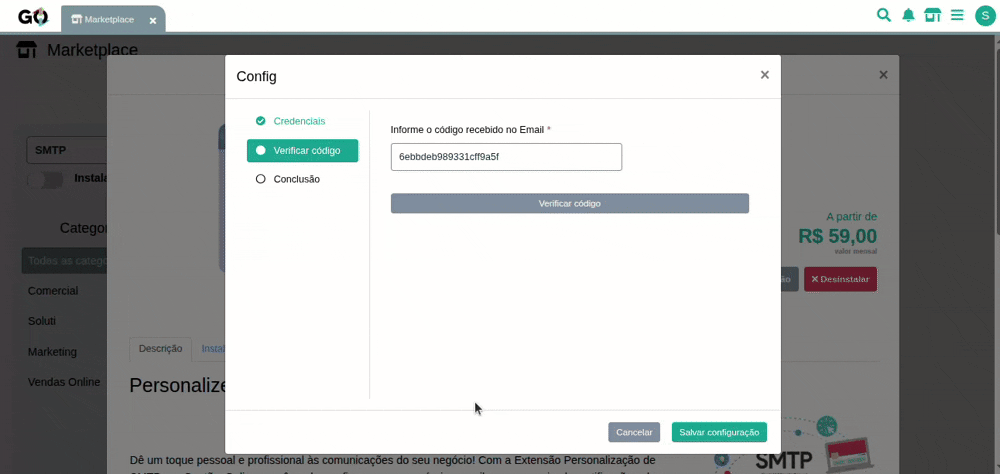
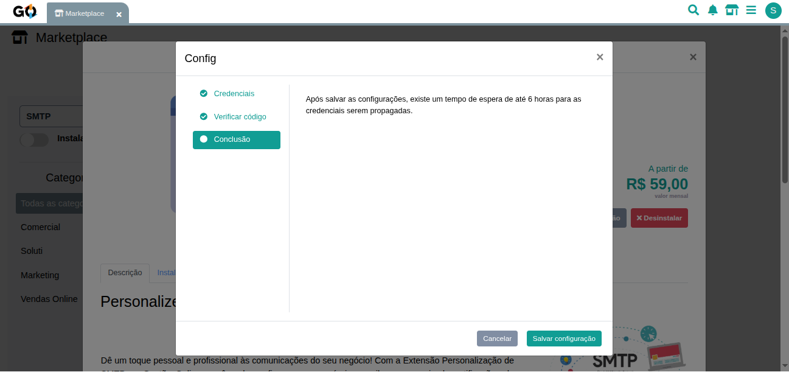

### Configurando a Personalização de SMTP

Este passo a passo vai te ajudar a configurar o SMTP no seu ERP, permitindo o envio de e-mails personalizados usando o servidor de e-mail da sua empresa. Siga as instruções abaixo:

Nesta aplicação ao clicar no botão de configurações uma notificação pop-up irá se abrir mostrando os campos disponíveis para alteração.

     

 

### Configurando credenciais

Preencha os campos obrigatórios marcados com * conforme as informações fornecidas pelo seu provedor de e-mail.

<h4 style="margin: 0 0 10px; font-size: 1em;">⚠️ Importante:</h4>
Verifique com o seu provedor de e-mail quais são as configurações corretas de domínio, porta e SSL.

No primeiro campo temos o **Nome de Domínio**, nele você pode preencher por exemplo: smtp.suaempresa.com. Caso não saiba o domínio, consulte o suporte técnico do provedor.

     

 

No segundo campo, você irá preencher com o número da porta que será usada para conexão com o servidor SMTP. As portas mais comuns são:

- **587**: Para conexões TLS.
- **465**: Para conexões SSL.
- **25**: Para servidores que não exigem criptografia (menos comum).

Mas sempre recomendamos que verifique com o seu provedor qual porta deve ser utilizada.

     

 

Agora nos campos de nome de usuário e senha, você primeiro irá digitar o nome de usuário da conta de e-mail que será utilizada para enviar os e-mails. Geralmente, é o próprio endereço de e-mail.

Insira também a senha correspondente à conta de e-mail utilizada. Certifique-se de que a senha está correta e que a conta tem permissão para envio via SMTP.

     

 

No campo de **Email Remetente** informe o e-mail que será exibido nas mensagens enviadas pelo seu Gestão Online, ou o mesmo e-mail usado no nome de usuário.

     

 

O campo SSL (Segurança da Conexão) é um seletor com três opções. Verifique com o provedor de e-mail qual tipo de segurança é necessário e selecione a opção adequada. Das três opções disponíveis, você pode escolher entre:

- **Vazio**: Escolha esta opção caso o servidor SMTP não exija criptografia.
- **SSL**: Escolha esta opção se o servidor requer uma conexão segura via SSL.
- **TLS**: Escolha esta opção se o servidor requer uma conexão segura via TLS.

     

Por último, após preencher os campos necessários, você pode clicar no botão **Testar credenciais** e enviaremos um teste para o seu servidor de SMTP. Se tudo estiver configurado corretamente, você receberá uma mensagem de confirmação, juntamente com um código que deverá ser inserido na próxima etapa para concluir a validação.

<h4 style="margin: 0 0 10px; font-size: 1em;">🚨 Atenção:</h4>
Caso apareça alguma mensagem de erro neste momento, você precisa revisar as informações inseridas, e se o erro persistir, você pode entrar em contato com nosso suporte para verificarmos o que pode ter acontecido.

     

 

### Código enviado por e-mail

Após a validação bem-sucedida das credenciais, o endereço informado no campo **Remetente** receberá um e-mail contendo um código de verificação, semelhante ao exemplo abaixo:

     

### Validando código

Nesta etapa, será necessário inserir o código recebido por e-mail para confirmar que o servidor está funcionando corretamente e concluir a configuração.

     

 
Com os dados preenchidos corretamente e os testes realizados com sucesso, agora você pode clicar no botão Salvar configurações para finalizar o processo. Uma mensagem será mostrada a você na janela de configuração da extensão, informando que as alterações levarão um tempo de até 6 horas para estarem em pleno funcionamento.

     

 

**Agora o seu SMTP está configurado e pronto para uso! 🎉**

