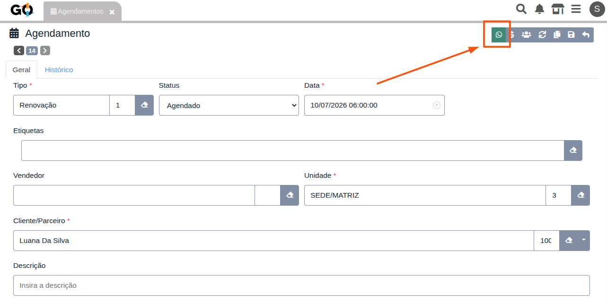
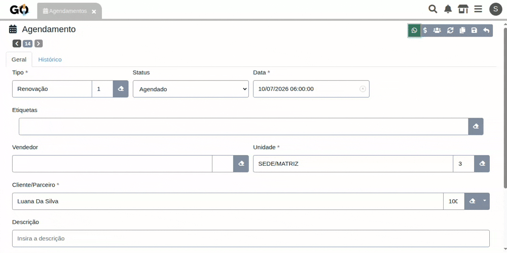

### Apresentamos a extensão Notificar Agendamento Manual!

| | |
|---|---|
| A **Extensão Notificar Agendamento Manual** facilita o envio de mensagens pelo **WhatsApp** para clientes que possuem um agendamento.   Ao selecionar um agendamento, a extensão identifica automaticamente o cliente vinculado e permite iniciar uma conversa de forma rápida. Essa funcionalidade é especialmente útil para lembrar os clientes de que o **certificado digital está próximo do vencimento**. Além da tela de agendamentos, o recurso também está disponível no **Dashboard de Agendamentos**. 
| 

 |

## Como Funciona na Prática

O processo é simples e intuitivo:

1. **Acesse a tela de Agendamentos** ou o **Dashboard de Agendamentos**.
2. **Selecione o agendamento** desejado.
3. **Clique na opção de notificar via WhatsApp**.
4. A extensão identifica automaticamente o **cliente vinculado ao agendamento** e exibe um **modal com a mensagem que será enviada**. Caso necessário, a mensagem pode ser editada antes do envio. Após a confirmação, o **WhatsApp** é aberto com a mensagem preenchida, pronta para envio ao cliente.

    

 

## Benefícios da Extensão

| Benefício                          | Como ajuda você                                                                                 |
| ---------------------------------- | ----------------------------------------------------------------------------------------------- |
| **Agilidade na comunicação**       | Entre em contato com o cliente em poucos cliques, sem precisar procurar seus dados manualmente. |
| **Integração com os agendamentos** | Disponível tanto na tela de Agendamentos quanto no Dashboard de Agendamentos.                   |
| **Lembretes de vencimento**        | Facilita o contato com clientes cujo certificado digital está próximo do vencimento.            |
| **Mais produtividade**             | Reduz etapas no processo de comunicação e torna o atendimento mais eficiente.                   |

 

### Agilize o Contato com seus Clientes

Com a **Extensão Notificar Agendamento Manual**, você torna o processo de comunicação mais rápido e organizado, utilizando as informações do próprio agendamento para entrar em contato com o cliente via WhatsApp.

**Mantenha seus clientes informados e facilite a renovação de certificados digitais com mais praticidade.**

