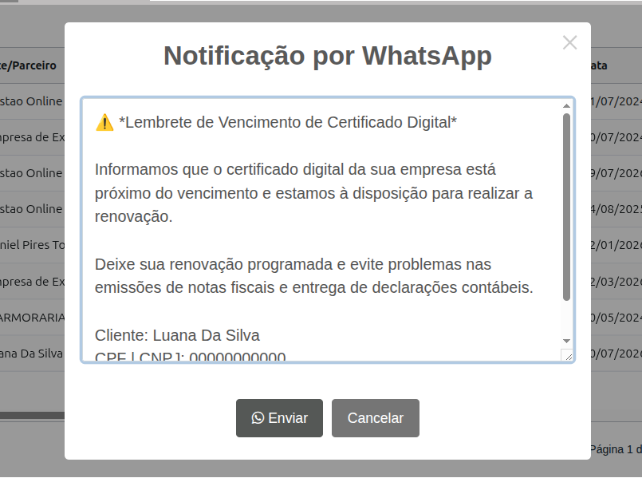
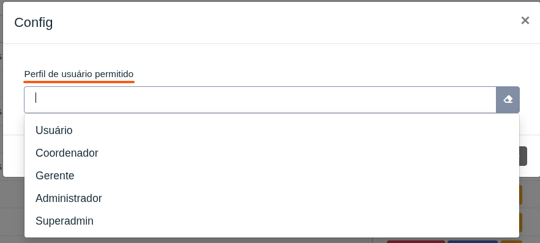
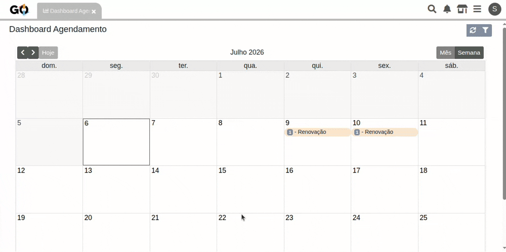

# Notificar Agendamento Manual

 **"Notificar Agendamento Manual"** é uma extensão do sistema Gestão Online que permite **enviar mensagens personalizadas pelo WhatsApp para o cliente vinculado a um agendamento**. A funcionalidade foi desenvolvida para agilizar a comunicação com clientes, sendo especialmente útil para **notificações sobre a proximidade do vencimento do certificado digital**.

Antes do envio, a extensão apresenta uma mensagem pré-preenchida com as informações do cliente e do agendamento, permitindo que o usuário faça alterações caso necessário.

## Modelo da Mensagem

    

## Configuração da Extensão

A extensão possui o seguinte campo de configuração:

    

 

| Campo                           | Função                                                      |
| ------------------------------- | ----------------------------------------------------------- |
| **Perfil de usuário permitido** | Define quais perfis de usuário poderão utilizar a extensão. |

# Fluxo de Notificação

Na tela de **Agendamentos**, o botão de **WhatsApp** estará disponível no canto superior esquerdo. A mesma funcionalidade também pode ser acessada clicando com o **botão direito do mouse** sobre um agendamento na listagem e selecionando a opção correspondente.

    

Ao clicar no botão, será aberto um **modal** contendo uma mensagem previamente preenchida com informações do cliente e do agendamento, como **nome, CPF e data de vencimento do certificado**.

A mensagem é totalmente editável, permitindo que o usuário personalize seu conteúdo antes de confirmar o envio.

    

Após a confirmação, o **WhatsApp será aberto** com a mensagem preenchida, pronta para ser enviada ao cliente.

**Observação:**

1. Para utilizar a extensão, é necessário que o cadastro do cliente possua um **telefone** ou **celular** válido e corretamente preenchido. Caso nenhum desses campos esteja informado, ou o número seja inválido, o sistema exibirá uma mensagem informando que o telefone do cliente não foi encontrado.

2. Além disso, a funcionalidade está disponível **apenas para agendamentos que ainda não venceram**.

## Dashboard de Agendamentos

A mesma funcionalidade também está disponível no **Dashboard de Agendamentos**, seguindo exatamente o mesmo fluxo de utilização.

    

