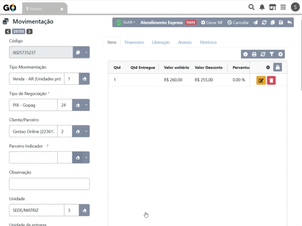
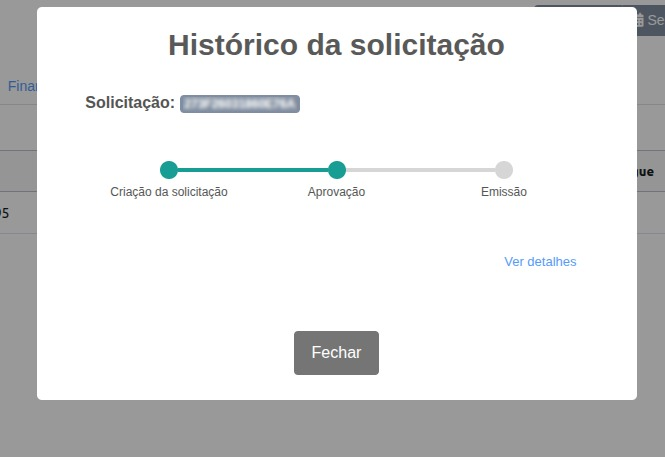
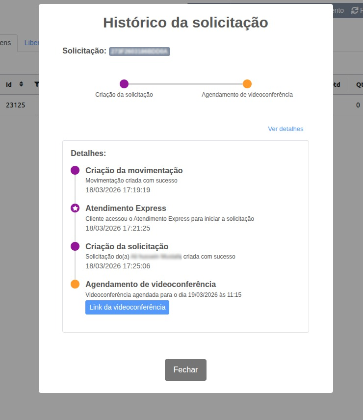
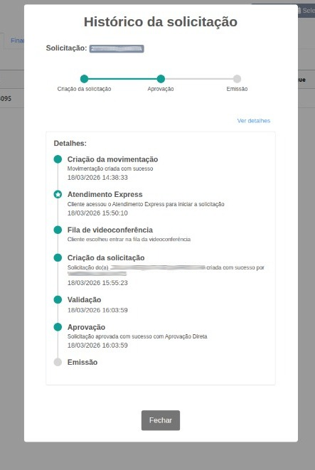

### Facilite a Gestão de Vendas e Agendamentos com a Extensão Sis AR - Soluti no Gestão Online

| | |
|-|-|
|A Extensão Sis AR - Soluti foi criada para oferecer aos revendedores e franqueados uma solução completa e prática para a gestão de suas operações de AC/AR diretamente no Gestão Online.  Com ela, você tem acesso a funcionalidades exclusivas que agilizam o processo de vendas e o acompanhamento de renovação de certificados, tudo em um único lugar. | |

 

### Principais Benefícios

| | | |
|-|-|-|
|**Atualização Automática de Entregas** A extensão facilita a atualização em tempo real das vendas realizadas, garantindo que todas as entregas sejam acompanhadas de forma rápida e precisa dentro do Gestão Online.|
_
|**Verificação de Agendamentos de Renovação** Com a funcionalidade de verificação de agendamentos, você pode consultar facilmente o status das renovações e entrar em contato com seus clientes de forma mais eficiente, otimizando o relacionamento e a comunicação.|
|**Facilidade de Uso** Integrada diretamente ao seu ERP, a extensão permite que todas as operações sejam realizadas sem a necessidade de alternar entre múltiplos sistemas, oferecendo uma experiência mais fluida e produtiva.||**Eficiência no Atendimento ao Cliente** A agilidade nas atualizações e no acompanhamento de renovação melhora o atendimento, promovendo uma gestão de clientes mais eficaz e aumentando suas oportunidades de vendas.|

 

### Acompanhamento da Solicitação de Certificado

| | | |
|-|-|-|
|Dentro da própria venda, é possível acessar o acompanhamento completo da solicitação de certificado digital por meio do botão **SISAR** , disponível após a validação da entrega.  Ao clicar nessa opção, o sistema apresenta um painel com o andamento da solicitação em formato visual, permitindo identificar de forma rápida em qual etapa o processo se encontra, como criação, agendamento de videoconferência, aprovação ou emissão. |
_
|  |

 

| | | |
|-|-|-|
|  |
_
|Essa visualização facilita o controle operacional e reduz a necessidade de consultas externas para entender o status do certificado.   Ao selecionar a opção **Ver detalhes**, é exibido um histórico completo da solicitação, organizado de forma cronológica, reunindo todas as interações realizadas ao longo do processo.|

| | | |
|-|-|-|
|Nesse detalhamento, é possível acompanhar cada etapa com mais profundidade, incluindo registros como criação da movimentação, acesso ao Atendimento Express (Caso utilize), criação da solicitação, entrada ou agendamento da videoconferência, validação, aprovação e emissão do certificado.  Cada evento apresenta data, horário e descrição da ação realizada, garantindo maior rastreabilidade e segurança na informação.  Quando houver agendamento de videoconferência, o próprio histórico disponibiliza o link de acesso, centralizando todas as informações necessárias em um único local. |
_
|  |

 

| | | |
|-|-|-|
|  |
_
| O fluxo da solicitação pode variar conforme o atendimento realizado. Em alguns casos, o cliente inicia pelo Atendimento Express, e em outros, segue diretamente para a videoconferência.   Independentemente do caminho, todas as etapas são registradas automaticamente e ficam disponíveis para consulta.|

 

Essa funcionalidade proporciona mais transparência no acompanhamento das solicitações, facilita o suporte ao cliente e permite que tenha uma visão completa de cada etapa do processo.

**Com a Extensão Sis AR - Soluti, você garante mais controle, organização e rapidez nas operações, facilitando o processo de vendas e melhorando a experiência do cliente de forma simples e eficaz.**

