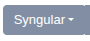
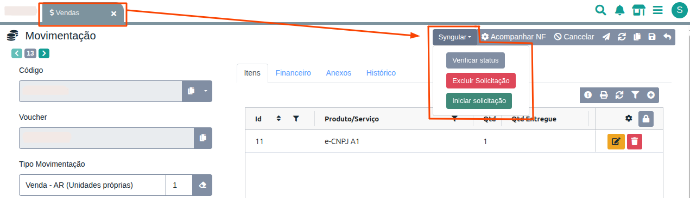
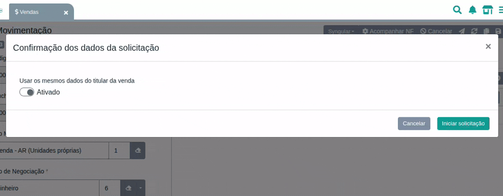
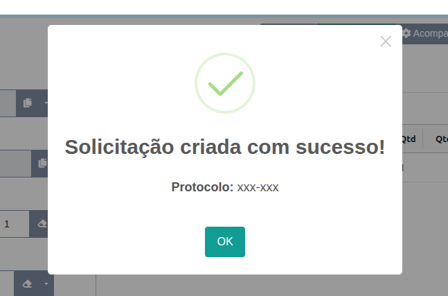
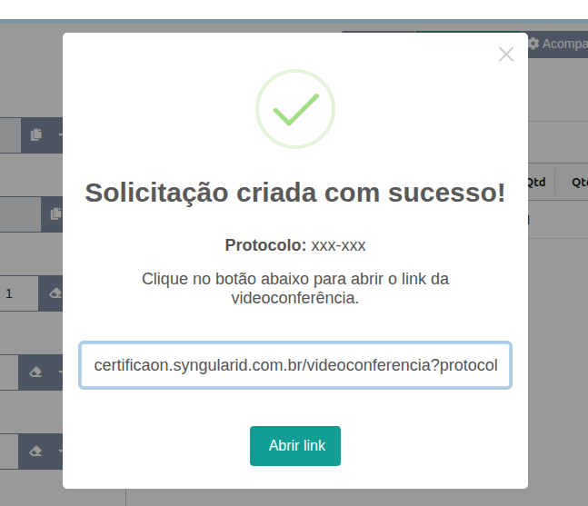
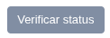
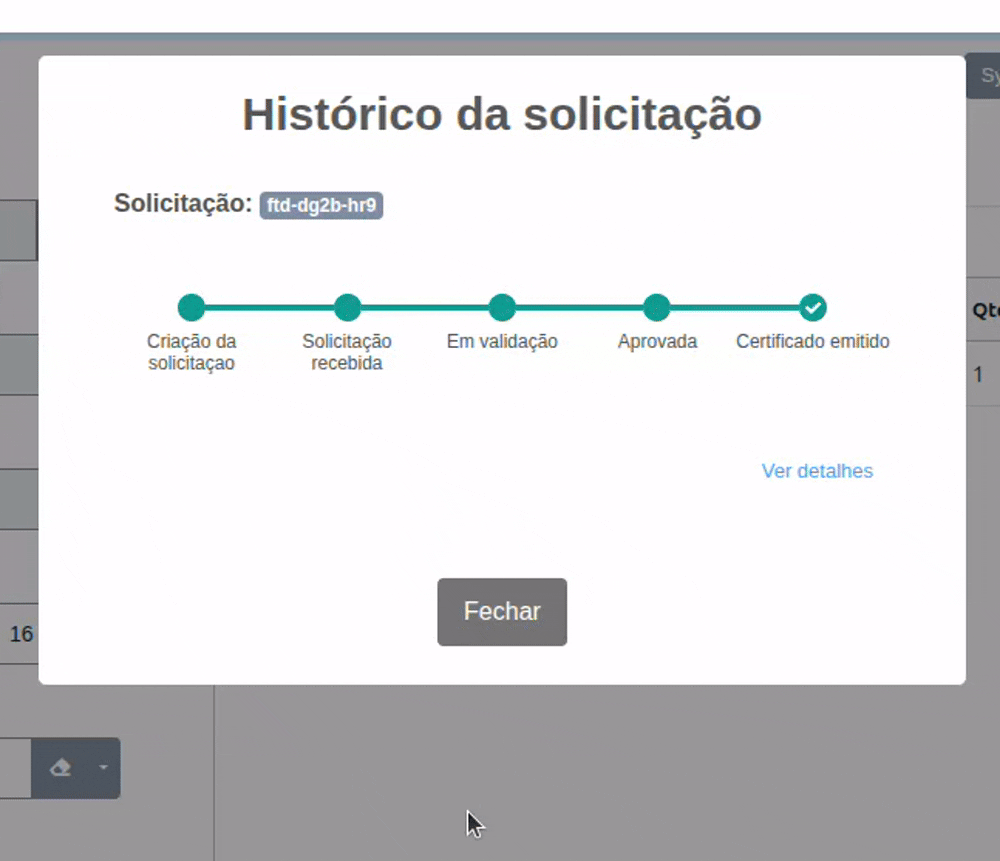
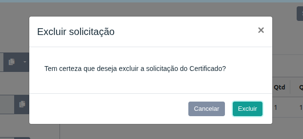

# Solicitação de Certificado pelo Gestão Online

Agora é possível realizar solicitações de certificados digitais diretamente pelo Gestão Online. Integrada ao fluxo da Syngular, essa funcionalidade centraliza o processo de emissão e acompanhamento dos certificados dentro da própria plataforma.

## Iniciando a Solicitação

Após finalizar a criação da venda e a inclusão do produto, estará disponível um botão no menu superior . Ao clicar nele, aparecerá a opção **"Iniciar Solicitação"**.

  

Ao clicar em **Iniciar Solicitação**, o sistema abrirá uma janela para definir o titular da solicitação:

* **Usar dados do titular da venda**: aproveita os dados já cadastrados na venda, como nome, CPF/CNPJ, e-mail e demais informações.
* Se desmarcado, será possível informar manualmente os dados do titular do certificado.

  

Após definir essa opção, clique em **Iniciar Solicitação**.

## Consulta de Dados do Cliente

O Gestão Online realiza a consulta dos dados do titular, identificando os responsáveis vinculados ao CNPJ informado ou, quando se tratar de uma pessoa física, os dados associados ao CPF.

Selecione o responsável desejado e clique em **Criar Solicitação**.

  

## Possíveis Retornos da Solicitação

Após a criação da solicitação, a Syngular retorna as informações necessárias para o acompanhamento do processo. Dependendo das regras aplicadas ao certificado solicitado, diferentes retornos poderão ser apresentados.

### 1. Solicitação criada sem videoconferência

Quando não houver necessidade de videoconferência, o sistema exibirá apenas o protocolo gerado para acompanhamento da solicitação.

  

### 2. Solicitação criada com videoconferência

Quando a validação exigir videoconferência, o sistema exibirá o protocolo da solicitação juntamente com o link de acesso.

Ao clicar em **Abrir Link**, você será redirecionado para a sala de videoconferência informada pela Syngular.

  

## Verificar Status da Solicitação

No botão  é possível acompanhar o andamento da solicitação.

Ao clicar nele, será exibida uma linha do tempo com todo o histórico da solicitação, incluindo os status registrados e os detalhes de cada etapa do processo.

  

## Excluir Solicitação

Através do botão  é possível excluir uma solicitação criada.

Ao clicar nele, o sistema exibirá uma janela de confirmação antes de realizar a exclusão.

  

## Finalização

Com a integração da Syngular ao Gestão Online, todo o processo de solicitação e acompanhamento de certificados digitais pode ser realizado diretamente na plataforma, proporcionando mais agilidade, praticidade e centralização das informações.
