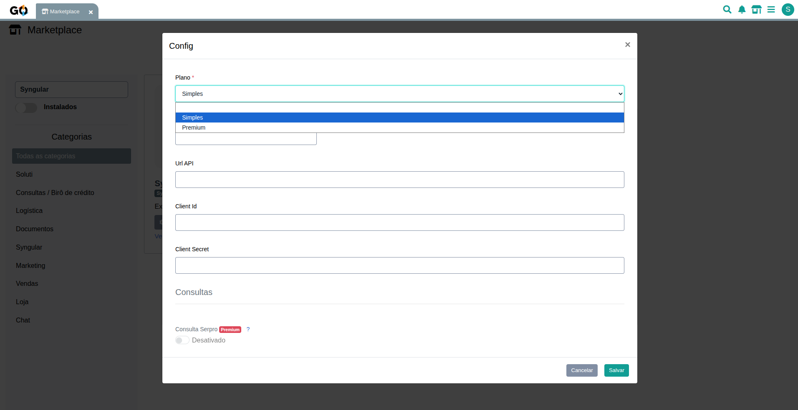
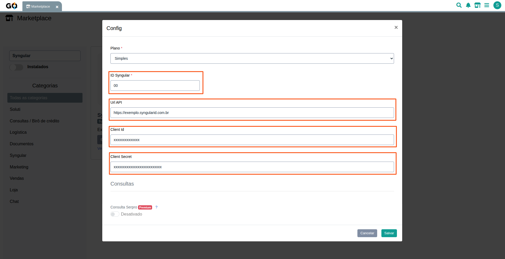
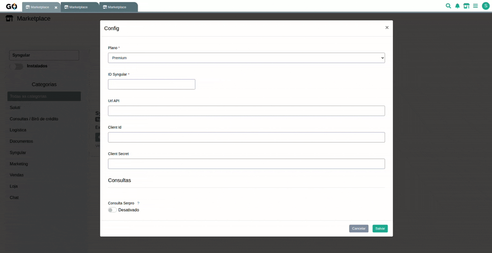

# Syngular - Integração

A extensão Syngular permite realizar solicitações de certificados digitais diretamente pelo Gestão Online durante o processo de venda. A integração centraliza o fluxo de emissão, reduz o preenchimento manual de informações e agiliza o atendimento ao cliente.

## Como configurar?

Ao clicar no ícone de configurações, estarão disponíveis os parâmetros necessários para o funcionamento da extensão.

No primeiro campo, é necessário definir o tipo de plano que será utilizado:

* **Gratuito:** Utiliza o fluxo padrão de atendimento.
* **Premium:** Utiliza um fluxo personalizado, permitindo a configuração de consultas através do SERPRO.

     

 

Logo abaixo, estão disponíveis os quatro campos obrigatórios para o funcionamento da integração.

     

| Campos            | Funções                                                                      |
| ----------------- | ---------------------------------------------------------------------------- |
| **ID Syngular**   | Identificador da Autoridade Registradora (AR) dentro da plataforma Syngular. |
| **Url API**       | Endereço da API da Syngular utilizado pela integração.                       |
| **Client Id**     | Identificador da aplicação utilizado para autenticação das requisições.      |
| **Client Secret** | Chave utilizada para autenticação e autorização de acesso à API.             |

### Configuração das Consultas

> **Importante:** As configurações de consulta descritas abaixo estão disponíveis apenas para clientes que utilizam o plano **Premium**. No plano **Gratuito**, a extensão utiliza exclusivamente os serviços disponibilizados pelo Gestão Online.

 

No último campo de configuração, determina-se como serão realizadas as consultas utilizadas para obtenção dos dados da empresa e validação dos dados do sócio ou titular do certificado digital, tornando o processo de emissão mais rápido e reduzindo a necessidade de preenchimento manual.

São disponibilizadas duas opções:

* **Gestão Online:** Utiliza o serviço de consultas do próprio Gestão Online, sem necessidade de configurações adicionais. Basta habilitar a opção e começar a utilizar. As consultas são realizadas para CPF e CNPJ.

* **Próprio:** Recomendado para empresas que já possuem contrato próprio com o SERPRO. Nesta modalidade, é necessário informar as credenciais correspondentes para habilitar as consultas através da integração.

     

