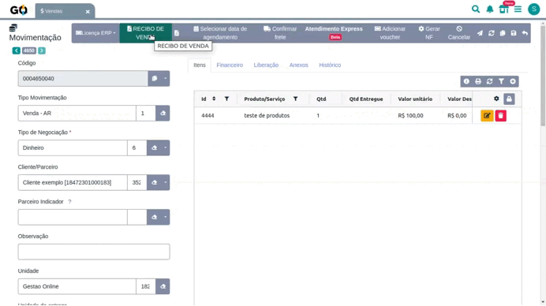
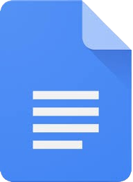
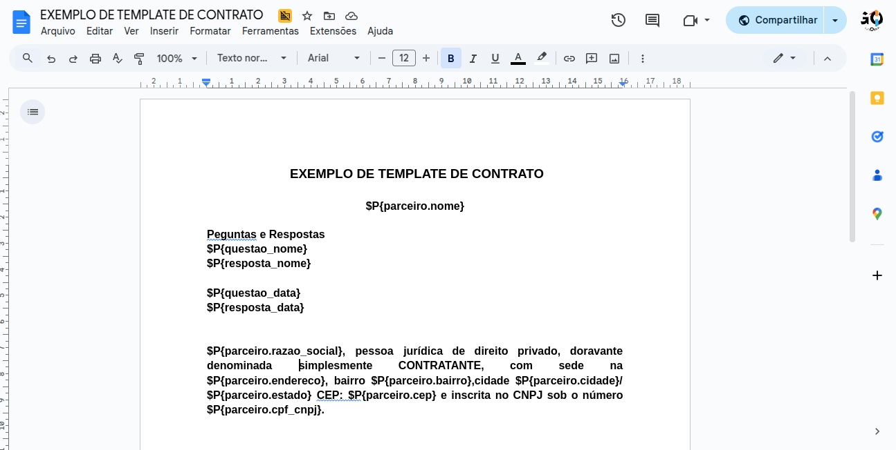

### GO DocBuilder 

| | ||
|-|-|-|
|No Gestão Online, desenvolvemos o GO DocBuilder, uma solução revolucionária que transforma templates do Google Docs em documentos PDF personalizados automaticamente.

| | | |
|-|-|-|
|O GO DocBuilder oferece uma integração perfeita entre seus dados empresariais e a criação de documentos profissionais, eliminando a necessidade de digitação manual e garantindo consistência em todos os seus documentos corporativos.|
__
||

 

|**1️⃣  Geração Automática com Dados do SistemaR** |
 _ 
|**2️⃣  Formulários Personalizados Dinâmicos** |
 _ 
|**3️⃣ Modo Híbrido Completo** |
|-|-|-|-|-|
|Utilize informações já cadastradas no sistema (parceiros, movimentações, unidades) para preencher automaticamente seus templates, eliminando retrabalho e erros de digitação. ||Crie questionários customizados que coletam informações específicas durante a geração do documento, permitindo personalização total para cada situação. ||Combine dados do sistema com respostas personalizadas, oferecendo máxima flexibilidade para criar documentos únicos que atendem qualquer necessidade empresarial.  |

 

### Principais Benefícios

| | | | |
|-|-|-|-| 
|  |
 ___ 
|**Integração Direta e Automática** Conecte templates do Google Docs diretamente ao Gestão Online, permitindo geração instantânea de documentos com dados atualizados em tempo real.  **Personalização Avançada** Configure botões específicos para diferentes telas e tipos de usuário, garantindo que cada equipe tenha acesso aos documentos adequados ao seu perfil.  **Tabelas Dinâmicas** Gere automaticamente tabelas com itens de movimentação, agrupando produtos por categoria e calculando totais, descontos e valores finais.  **Anexação Automática** Configure para que os documentos gerados sejam automaticamente anexados aos registros correspondentes, criando um histórico.   **Automatização Inteligente** O sistema identifica automaticamente que tipo de documento gerar baseado no contexto (venda, contrato, proposta), aplicando as variáveis corretas automaticamente

 

| | | |
|-|-|-|
|**Como Funciona na Prática**  O GO DocBuilder utiliza um sistema inteligente de variáveis que se conecta diretamente aos dados do Gestão Online:  1. **Template Inteligente**: Crie seu modelo no Google Docs usando variáveis como `$P{parceiro.nome}`, `$P{valor_total}`, etc.  2. **Configuração Simples**: Configure quais documentos aparecerão em cada tela do sistema, definindo permissões por perfil de usuário.  3. **Geração Instantânea**: Com um clique, o sistema busca o template, substitui todas as variáveis pelos dados reais e gera um PDF profissional.  4. **Formulários Dinâmicos**: Se configurado, apresenta um formulário personalizado para coletar informações específicas antes da geração.  5. **Entrega Automática**: O documento é gerado instantaneamente e pode ser baixado, visualizado ou anexado automaticamente ao registro.|
__
||

 

### **Recursos Avançados**

**Reconhecimento Inteligente**: O sistema reconhece automaticamente mais de 100 variáveis diferentes do Gestão Online, desde dados básicos até informações complexas de movimentações e relacionamentos.

**Tabelas Responsivas**: Crie tabelas que se expandem automaticamente conforme a quantidade de itens, mantendo a formatação profissional independente do volume de dados.

**Formatação Automática**: Valores monetários, datas, CPF/CNPJ e outros campos são formatados automaticamente seguindo padrões brasileiros.

**Multi-entidade**: Funciona com Movimentações (Vendas/Pedidos/Recorrência), Parceiros, Usuários, Unidades e Contratos de Controle, oferecendo versatilidade total.

###  **Casos de Uso Ideais**

* **Contratos Comerciais**: Gere contratos personalizados com dados do cliente e condições específicas  
* **Propostas Comerciais**: Crie propostas profissionais com itens, valores e condições automaticamente  
* **Relatórios Gerenciais**: Produza relatórios formatados com dados atualizados do sistema  
* **Documentos Fiscais**: Gere documentos complementares com informações fiscais e empresariais  
* **Certificados e Declarações**: Emita certificados personalizados com dados dos usuários ou parceiros

O GO DocBuilder é a escolha perfeita para empresas que buscam profissionalizar e agilizar a criação de documentos, oferecendo um sistema inteligente, flexível e totalmente integrado ao Gestão Online.
 

**Transforme a gestão de documentos da sua empresa com o GO DocBuilder\!**

 

