# 📦 **GO DocBuilder**

**Descrição:**  
A GO DocBuilder é uma extensão do sistema Gestão Online que permite gerar documentos em PDF (como contratos e propostas comerciais) baseados em templates do Google Docs.

Esta extensão busca um documento modelo no Google Docs, substitui tags por dados do sistema (como nome do parceiro, endereço, CNPJ, etc.) e perguntas/respostas personalizadas inseridas pelo usuário, gerando um PDF final automaticamente.

**Como criar o Template no Google Docs**

  

Crie um documento no Google Docs com as variáveis a serem substituídas. As variáveis devem ser colocadas no formato:

* `$P{parceiro.nome}`  
* `$P{parceiro.cpf_cnpj}`  
* `$P{questao_nome}`  
* `$P`{resposta\_\[nome\_da\_pergunta\]}

Essas variáveis serão substituídas automaticamente com os dados da entidade e respostas do formulário.

## **Configuração da Extensão**

### **1\. Acesso à Configuração**

Para configurar a extensão GO DocBuilder:

  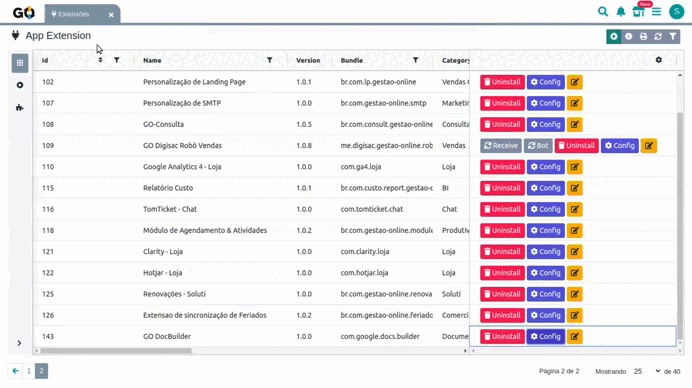

 

1. Acesse o menu de Extensões no sistema  
2. Localize a extensão GO DocBuilder  
3. Clique em Configurar

*2\. Campos de Configuração**

### Na tela que abrir, você verá uma tabela com os documentos já configurados:

* Cada linha representa um botão que aparecerá nas telas do sistema  
* Se for a primeira vez, a tabela estará vazia  

  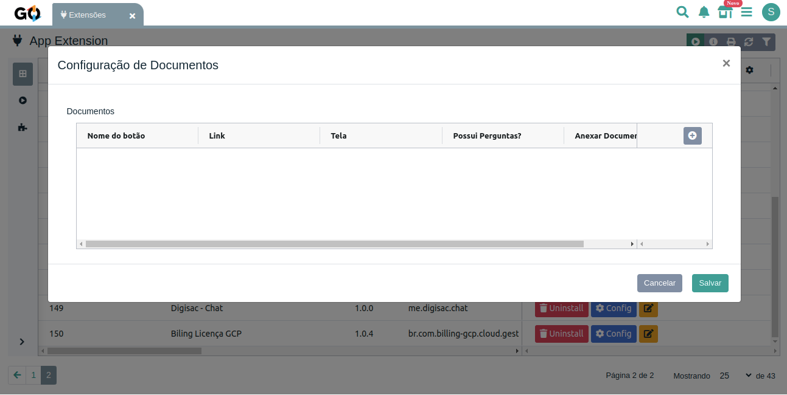

 

**Adicionar Novo Documento**

1. Clique no botão "+" no canto superior direito da tabela  
2. Um formulário será aberto com os campos de configuração!

  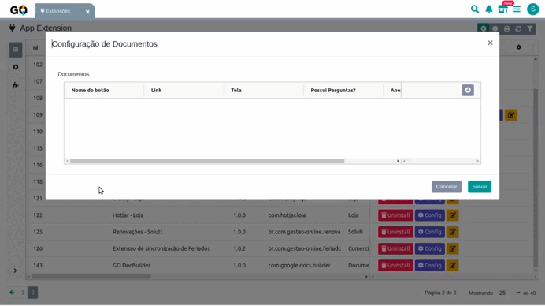

#### 

#### 

#### **Campos obrigatórios**

*  Nome do botão: Nome que aparecerá no botão na tela

* Tela: Onde o botão deve aparecer (Movimentação, Parceiro, etc.)  
* Link: URL do documento do Google Docs
  

  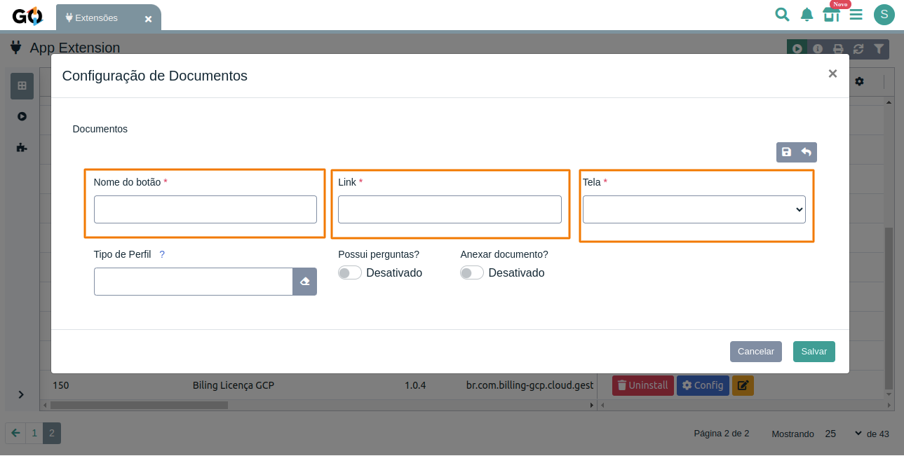

 

**Tipo Movimentação**

Quando a tela for "Movimentação", permite especificar em qual tipo de movimentação o botão deve aparecer Quando você associa o botão a um ou mais tipos de movimentação ele só será exibido nas telas de movimentação que correspondam ao tipo selecionado.

Caso nenhum tipo seja selecionado, o botão não será exibido em nenhuma movimentação.

  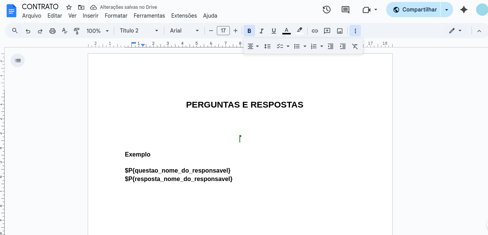

 

Assim que é finalizado todas as etapas, um aviso no estilo pop-up é exibido ao usuário dentro do Gestão Online. Informando que foi feito o certificado foi emitido e um agendamento do vencimento deste certificado que foi criado dentro da tela de Agendamentos.

#### **Campo: Tipo de Perfil**

Este campo define quais perfis de usuário do sistema têm permissão para visualizar e utilizar o botão configurado. Quando você associa o botão a um ou mais perfis, ele só será exibido para os usuários que possuírem um dos perfis selecionados. Se outro usuário logado tiver um perfil diferente (não listado na configuração), ele não verá o botão.

#### É possível associar múltiplos perfis ao botão, permitindo que diferentes papéis o utilizem.

Caso nenhum perfil seja selecionado, o botão não será exibido para ninguém.

  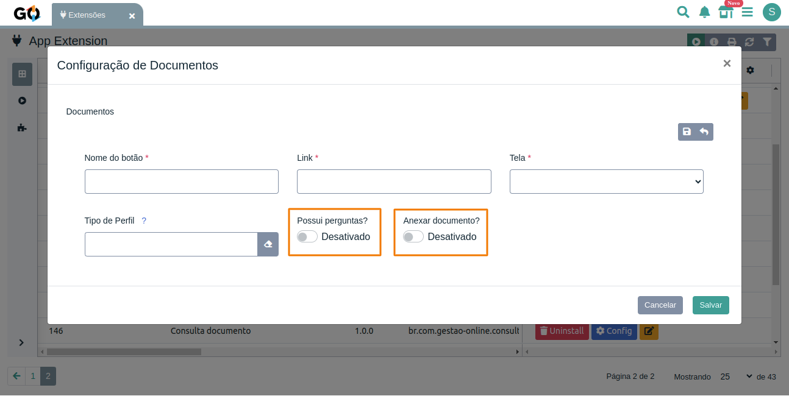

 

#### 

#### 

#### **Campos opcionais:**

Possui Perguntas?: Ativa formulário com perguntas personalizadas

Anexar Documento?: Se deve salvar o PDF como anexo da entidade
 

### **Configuração de Perguntas**

Quando "Possui Perguntas?" está ativado, você pode configurar:

* Título da Pergunta: Texto da pergunta  
* Tipo do Campo: Texto, Data ou Área de Texto  
* Obrigatório?: Se o campo é obrigatório  
* Colunas: Layout da pergunta (1-12 colunas)
 

  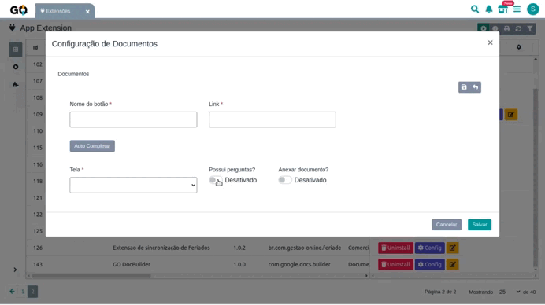

 

### **Anexos Automáticos**

Quando ativado, o PDF gerado é:

* Salvo como anexo da entidade  
* Registrado no histórico  
* Associado automaticamente ao registro

  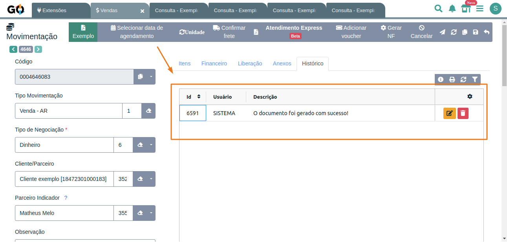

**Variáveis Disponíveis por Tela**

IMPORTANTE: As variáveis listadas abaixo são POSSÍVEIS para cada tela, mas só existem se o campo correspondente existir na entidade. 

  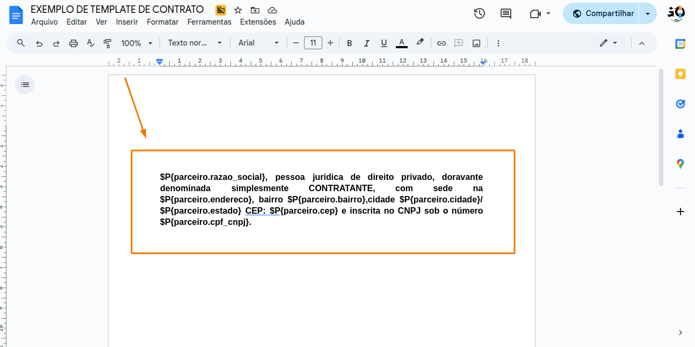

### **MOVIMENTAÇÃO (movVenda, movPedido, movRecorrencia)**

#### **Dados Básicos da Movimentação:**

* $P{id} \- ID da movimentação  
* $P{tipo} \- Tipo (V, PV, R)  
* $P{codigo} \- Código interno  
* $P{codigo\_externo} \- Código externo  
* $P{status} \- Status da movimentação  
*  $P{observacao} \- Observações

  #### **Valores e Financeiro:**

* $P{valor\_total} \- Valor total (formatado: 1.234,56)  
* $P{valor\_desconto} \- Valor do desconto (formatado)  
* $P{valor\_frete} \- Valor do frete (formatado)  
* $P{valor\_retido} \- Valor retido (formatado)  
*  $P{percentual\_desconto} \- Percentual de desconto

  #### Datas:

* $P{data\_negociacao} \- Data da negociação (dd/mm/aaaa)  
* $P{data\_faturamento} \- Data do faturamento (dd/mm/aaaa)

  #### **Itens da Movimentação:**

* $P{movimentacao\_itens\_descricao} \- Descrição dos itens  
*  $P{movimentacao\_itens\_quantidade} \- Quantidade dos itens

  #### **Dados de Recorrência:**

* $P{recorrencia\_numero\_contrato} \- Número do contrato  
* $P{recorrencia\_inicio\_contrato} \- Data início (dd/mm/aaaa)  
* $P{recorrencia\_validade\_contrato} \- Data validade (dd/mm/aaaa)  
* $P{recorrencia\_periodicidade} \- Periodicidade  
* $P{recorrencia\_dias\_para\_faturar} \- Dias para faturar  
* $P{recorrencia\_status} \- Status da recorrência  
* $P{recorrencia\_tentativa} \- Número de tentativas  
* $P{recorrencia\_dia\_proxima\_tentativa} \- Próxima tentativa (dd/mm/aaaa)  
*  $P{recorrencia\_dia\_proxima\_fatura} \- Próxima fatura (dd/mm/aaaa)

  #### **Campos Especiais para Propostas:**

* $P{num.proposta} \- Número da proposta  
* $P{validade.proposta} \- Data de validade da proposta (dd/mm/aaaa)  
* $P{observacao.proposta} \- Observações da proposta  
*  $P{contato.nome} \- Nome do contato do parceiro

  #### **Tipo de Movimentação:**

* $P{tipo\_movimentacao.id} \- ID do tipo  
* $P{tipo\_movimentacao.descricao} \- Descrição do tipo  
* $P{tipo\_movimentacao.status} \- Status do tipo  
*  $P{tipo\_movimentacao.tipo} \- Tipo

  #### **Tipo de Movimentação Destino:**

* $P{tipo\_movimentacao\_destino.id} \- ID do tipo destino  
* $P{tipo\_movimentacao\_destino.descricao} \- Descrição do tipo destino  
* $P{tipo\_movimentacao\_destino.status} \- Status do tipo destino  
*  $P{tipo\_movimentacao\_destino.tipo} \- Tipo destino

  #### **Tipo de Negociação:**

* $P{tipo\_negociacao.id} \- ID do tipo de negociação  
* $P{tipo\_negociacao.descricao} \- Descrição  
* $P{tipo\_negociacao.status} \- Status  
*  $P{tipo\_negociacao.codigo} \- Código

  #### **Dados do Parceiro (Cliente):**

* $P{parceiro.id} \- ID do parceiro  
* $P{parceiro.nome} \- Nome/Razão social  
* $P{parceiro.razao\_social} \- Razão social  
* $P{parceiro.cpf\_cnpj} \- CPF/CNPJ (formatado)  
* $P{parceiro.tipo\_pessoa} \- F (Física) ou J (Jurídica)  
* $P{parceiro.data\_de\_nascimento} \- Data nascimento (dd/mm/aaaa)  
* $P{parceiro.codigo} \- Código do parceiro  
* $P{parceiro.email} \- E-mail  
* $P{parceiro.telefone} \- Telefone  
* $P{parceiro.celular} \- Celular  
* $P{parceiro.telefone\_comercial} \- Telefone comercial  
* $P{parceiro.cep} \- CEP  
* $P{parceiro.endereco} \- Endereço  
* $P{parceiro.numero} \- Número  
* $P{parceiro.complemento} \- Complemento  
* $P{parceiro.bairro} \- Bairro  
* $P{parceiro.cidade} \- Cidade  
* $P{parceiro.estado} \- Estado  
*  $P{parceiro.completo} \- Endereço completo

  #### **Dados do Parceiro Indicador:**

* $P{parceiro\_indicador.id} \- ID do indicador  
* $P{parceiro\_indicador.nome} \- Nome do indicador  
* $P{parceiro\_indicador.cpf\_cnpj} \- CPF/CNPJ do indicador  
* $P{parceiro\_indicador.tipo\_pessoa} \- Tipo de pessoa  
* $P{parceiro\_indicador.data\_de\_nascimento} \- Data nascimento  
* $P{parceiro\_indicador.codigo} \- Código  
* $P{parceiro\_indicador.razao\_social} \- Razão social  
* $P{parceiro\_indicador.email} \- E-mail do indicador  
* $P{parceiro\_indicador.telefone} \- Telefone do indicador  
* $P{parceiro\_indicador.celular} \- Celular do indicador  
* $P{parceiro\_indicador.telefone\_comercial} \- Telefone comercial  
* $P{parceiro\_indicador.cep} \- CEP  
* $P{parceiro\_indicador.endereco} \- Endereço do indicador  
* $P{parceiro\_indicador.numero} \- Número  
* $P{parceiro\_indicador.complemento} \- Complemento  
* $P{parceiro\_indicador.bairro} \- Bairro  
* $P{parceiro\_indicador.cidade} \- Cidade do indicador  
* $P{parceiro\_indicador.estado} \- Estado do indicador  
*  $P{parceiro\_indicador.completo} \- Endereço completo

  #### **Dados da Unidade:**

* $P{unidade.id} \- ID da unidade  
* $P{unidade.descricao} \- Descrição da unidade  
* $P{unidade.identificador} \- Identificador  
* $P{unidade.descricao\_completa} \- Descrição completa  
* $P{unidade.status} \- Status da unidade  
* $P{unidade.codigo} \- Código da unidade  
* $P{unidade.telefone} \- Telefone da unidade  
* $P{unidade.celular} \- Celular da unidade  
* $P{unidade.email} \- E-mail da unidade  
* $P{unidade.endereco} \- Endereço da unidade  
* $P{unidade.numero} \- Número da unidade  
* $P{unidade.complemento} \- Complemento da unidade  
* $P{unidade.bairro} \- Bairro da unidade  
* $P{unidade.cidade} \- Cidade da unidade  
* $P{unidade.estado} \- Estado da unidade

  #### **Dados da Empresa:**

* $P{empresa.id} \- ID da empresa  
* $P{empresa.cnpj} \- CNPJ (formatado)  
* $P{empresa.inscricao\_estadual} \- Inscrição estadual  
* $P{empresa.nome\_fantasia} \- Nome fantasia  
* $P{empresa.telefone} \- Telefone da empresa  
* $P{empresa.celular} \- Celular da empresa  
* $P{empresa.email} \- E-mail da empresa  
* $P{empresa.cep} \- CEP da empresa  
* $P{empresa.endereco} \- Endereço da empresa  
* $P{empresa.numero} \- Número da empresa  
* $P{empresa.complemento} \- Complemento da empresa  
* $P{empresa.bairro} \- Bairro da empresa  
* $P{empresa.cidade} \- Cidade da empresa  
* $P{empresa.estado} \- Estado da empresa

  #### **Dados do Vendedor:**

* $P{vendedor.id} \- ID do vendedor  
* $P{vendedor.nome} \- Nome do vendedor  
*  $P{vendedor.email} \- E-mail do vendedor

  ### **PARCEIRO (parceiroCliente, parceiroIndicador, parceiroFornecedor)**

  #### **Dados Básicos**:

* $P{id} \- ID do parceiro  
* $P{nome} \- Nome  
* $P{email} \- E-mail  
* $P{telefone} \- Telefone  
* $P{celular} \- Celular  
*  $P{cpf\_cnpj} \- CPF/CNPJ (formatado)

  #### **Dados Completos do Parceiro:**

* $P{parceiro.nome} \- Nome   
* $P{parceiro.razao\_social} \- Razão social  
* $P{parceiro.cpf\_cnpj} \- CPF/CNPJ (formatado)  
* $P{parceiro.tipo\_pessoa} \- F (Física) ou J (Jurídica)  
* $P{parceiro.data\_de\_nascimento} \- Data nascimento (dd/mm/aaaa)  
* $P{parceiro.codigo} \- Código do parceiro  
* $P{parceiro.email} \- E-mail  
* $P{parceiro.telefone} \- Telefone  
* $P{parceiro.celular} \- Celular  
* $P{parceiro.telefone\_comercial} \- Telefone comercial  
* $P{parceiro.cep} \- CEP  
* $P{parceiro.endereco} \- Endereço  
* $P{parceiro.numero} \- Número  
* $P{parceiro.complemento} \- Complemento  
* $P{parceiro.bairro} \- Bairro  
* $P{parceiro.cidade} \- Cidade  
* $P{parceiro.estado} \- Estado  
*  $P{parceiro.completo} \- Endereço completo

  ### **USUÁRIO (usuario)**

  #### Dados do Usuário:

* $P{id} \- ID do usuário  
* $P{nome} \- Nome do usuário  
* $P{email} \- E-mail  
* $P{username} \- Nome de usuário  
* $P{celular} \- Celular  
* $P{documento} \- CPF/CNPJ (formatado)  
* $P{pais} \- País  
* $P{estado} \- Estado  
* $P{cidade} \- Cidade  
* $P{endereco} \- Endereço  
* $P{cep} \- CEP### **MOVIMENTAÇÃO (movVenda, movPedido, movRecorrencia)**

#### **Dados Básicos da Movimentação:**

* $P{id} \- ID da movimentação  
* $P{tipo} \- Tipo (V, PV, R)  
* $P{codigo} \- Código interno  
* $P{codigo\_externo} \- Código externo  
* $P{status} \- Status da movimentação  
* $P{observacao} \- Observações

  #### **Valores e Financeiro:**

* $P{valor\_total} \- Valor total (formatado: 1.234,56)  
* $P{valor\_desconto} \- Valor do desconto (formatado)  
* $P{valor\_frete} \- Valor do frete (formatado)  
* $P{valor\_retido} \- Valor retido (formatado)  
* $P{percentual\_desconto} \- Percentual de desconto

  #### Datas:

* $P{data\_negociacao} \- Data da negociação (dd/mm/aaaa)  
* $P{data\_faturamento} \- Data do faturamento (dd/mm/aaaa)

  #### **Itens da Movimentação:**

* $P{movimentacao\_itens\_descricao} \- Descrição dos itens  
* $P{movimentacao\_itens\_quantidade} \- Quantidade dos itens

  #### **Dados de Recorrência:**

* $P{recorrencia\_numero\_contrato} \- Número do contrato  
* $P{recorrencia\_inicio\_contrato} \- Data início (dd/mm/aaaa)  
* $P{recorrencia\_validade\_contrato} \- Data validade (dd/mm/aaaa)  
* $P{recorrencia\_periodicidade} \- Periodicidade  
* $P{recorrencia\_dias\_para\_faturar} \- Dias para faturar  
* $P{recorrencia\_status} \- Status da recorrência  
* $P{recorrencia\_tentativa} \- Número de tentativas  
* $P{recorrencia\_dia\_proxima\_tentativa} \- Próxima tentativa (dd/mm/aaaa)  
* $P{recorrencia\_dia\_proxima\_fatura} \- Próxima fatura (dd/mm/aaaa)

  #### **Campos Especiais para Propostas:**

* $P{num.proposta} \- Número da proposta  
* $P{validade.proposta} \- Data de validade da proposta (dd/mm/aaaa)  
* $P{observacao.proposta} \- Observações da proposta  
*  $P{contato.nome} \- Nome do contato do parceiro

  #### **Tipo de Movimentação:**

* $P{tipo\_movimentacao.id} \- ID do tipo  
* $P{tipo\_movimentacao.descricao} \- Descrição do tipo  
* $P{tipo\_movimentacao.status} \- Status do tipo  
*  $P{tipo\_movimentacao.tipo} \- Tipo

  #### **Tipo de Movimentação Destino:**

* $P{tipo\_movimentacao\_destino.id} \- ID do tipo destino  
* $P{tipo\_movimentacao\_destino.descricao} \- Descrição do tipo destino  
* $P{tipo\_movimentacao\_destino.status} \- Status do tipo destino  
*  $P{tipo\_movimentacao\_destino.tipo} \- Tipo destino

  #### **Tipo de Negociação:**

* $P{tipo\_negociacao.id} \- ID do tipo de negociação  
* $P{tipo\_negociacao.descricao} \- Descrição  
* $P{tipo\_negociacao.status} \- Status  
*  $P{tipo\_negociacao.codigo} \- Código

  #### **Dados do Parceiro (Cliente):**

* $P{parceiro.id} \- ID do parceiro  
* $P{parceiro.nome} \- Nome/Razão social  
* $P{parceiro.razao\_social} \- Razão social  
* $P{parceiro.cpf\_cnpj} \- CPF/CNPJ (formatado)  
* $P{parceiro.tipo\_pessoa} \- F (Física) ou J (Jurídica)  
* $P{parceiro.data\_de\_nascimento} \- Data nascimento (dd/mm/aaaa)  
* $P{parceiro.codigo} \- Código do parceiro  
* $P{parceiro.email} \- E-mail  
* $P{parceiro.telefone} \- Telefone  
* $P{parceiro.celular} \- Celular  
* $P{parceiro.telefone\_comercial} \- Telefone comercial  
* $P{parceiro.cep} \- CEP  
* $P{parceiro.endereco} \- Endereço  
* $P{parceiro.numero} \- Número  
* $P{parceiro.complemento} \- Complemento  
* $P{parceiro.bairro} \- Bairro  
* $P{parceiro.cidade} \- Cidade  
* $P{parceiro.estado} \- Estado  
* $P{parceiro.completo} \- Endereço completo

  #### **Dados do Parceiro Indicador:**

* $P{parceiro\_indicador.id} \- ID do indicador  
* $P{parceiro\_indicador.nome} \- Nome do indicador  
* $P{parceiro\_indicador.cpf\_cnpj} \- CPF/CNPJ do indicador  
* $P{parceiro\_indicador.tipo\_pessoa} \- Tipo de pessoa  
* $P{parceiro\_indicador.data\_de\_nascimento} \- Data nascimento  
* $P{parceiro\_indicador.codigo} \- Código  
* $P{parceiro\_indicador.razao\_social} \- Razão social  
* $P{parceiro\_indicador.email} \- E-mail do indicador  
* $P{parceiro\_indicador.telefone} \- Telefone do indicador  
* $P{parceiro\_indicador.celular} \- Celular do indicador  
* $P{parceiro\_indicador.telefone\_comercial} \- Telefone comercial  
* $P{parceiro\_indicador.cep} \- CEP  
* $P{parceiro\_indicador.endereco} \- Endereço do indicador  
* $P{parceiro\_indicador.numero} \- Número  
* $P{parceiro\_indicador.complemento} \- Complemento  
* $P{parceiro\_indicador.bairro} \- Bairro  
* $P{parceiro\_indicador.cidade} \- Cidade do indicador  
* $P{parceiro\_indicador.estado} \- Estado do indicador  
* $P{parceiro\_indicador.completo} \- Endereço completo

  #### **Dados da Unidade:**

* $P{unidade.id} \- ID da unidade  
* $P{unidade.descricao} \- Descrição da unidade  
* $P{unidade.identificador} \- Identificador  
* $P{unidade.descricao\_completa} \- Descrição completa  
* $P{unidade.status} \- Status da unidade  
* $P{unidade.codigo} \- Código da unidade  
* $P{unidade.telefone} \- Telefone da unidade  
* $P{unidade.celular} \- Celular da unidade  
* $P{unidade.email} \- E-mail da unidade  
* $P{unidade.endereco} \- Endereço da unidade  
* $P{unidade.numero} \- Número da unidade  
* $P{unidade.complemento} \- Complemento da unidade  
* $P{unidade.bairro} \- Bairro da unidade  
* $P{unidade.cidade} \- Cidade da unidade  
*  $P{unidade.estado} \- Estado da unidade

  #### **Dados da Empresa:**

* $P{empresa.id} \- ID da empresa  
* $P{empresa.cnpj} \- CNPJ (formatado)  
* $P{empresa.inscricao\_estadual} \- Inscrição estadual  
* $P{empresa.nome\_fantasia} \- Nome fantasia  
* $P{empresa.telefone} \- Telefone da empresa  
* $P{empresa.celular} \- Celular da empresa  
* $P{empresa.email} \- E-mail da empresa  
* $P{empresa.cep} \- CEP da empresa  
* $P{empresa.endereco} \- Endereço da empresa  
* $P{empresa.numero} \- Número da empresa  
* $P{empresa.complemento} \- Complemento da empresa  
* $P{empresa.bairro} \- Bairro da empresa  
* $P{empresa.cidade} \- Cidade da empresa  
* $P{empresa.estado} \- Estado da empresa

  #### **Dados do Vendedor:**

* $P{vendedor.id} \- ID do vendedor  
* $P{vendedor.nome} \- Nome do vendedor  
* $P{vendedor.email} \- E-mail do vendedor

  ### **PARCEIRO (parceiroCliente, parceiroIndicador, parceiroFornecedor)**

  #### **Dados Básicos**:

* $P{id} \- ID do parceiro  
* $P{nome} \- Nome  
* $P{email} \- E-mail  
* $P{telefone} \- Telefone  
* $P{celular} \- Celular  
* $P{cpf\_cnpj} \- CPF/CNPJ (formatado)

  #### **Dados Completos do Parceiro:**

* $P{parceiro.nome} \- Nome   
* $P{parceiro.razao\_social} \- Razão social  
* $P{parceiro.cpf\_cnpj} \- CPF/CNPJ (formatado)  
* $P{parceiro.tipo\_pessoa} \- F (Física) ou J (Jurídica)  
* $P{parceiro.data\_de\_nascimento} \- Data nascimento (dd/mm/aaaa)  
* $P{parceiro.codigo} \- Código do parceiro  
* $P{parceiro.email} \- E-mail  
* $P{parceiro.telefone} \- Telefone  
* $P{parceiro.celular} \- Celular  
* $P{parceiro.telefone\_comercial} \- Telefone comercial  
* $P{parceiro.cep} \- CEP  
* $P{parceiro.endereco} \- Endereço  
* $P{parceiro.numero} \- Número  
* $P{parceiro.complemento} \- Complemento  
* $P{parceiro.bairro} \- Bairro  
* $P{parceiro.cidade} \- Cidade  
* $P{parceiro.estado} \- Estado  
* $P{parceiro.completo} \- Endereço completo

  ### **USUÁRIO (usuario)**

  #### Dados do Usuário:

* $P{id} \- ID do usuário  
* $P{nome} \- Nome do usuário  
* $P{email} \- E-mail  

  ### UNIDADE (unidade)

  #### **Dados da Unidade:**

* $P{id} \- ID da unidade  
* $P{descricao} \- Descrição  
* $P{telefone} \- Telefone  
* $P{email} \- E-mail  
* $P{unidade.descricao} \- Descrição (com prefixo)  
* $P{unidade.identificador} \- Identificador  
* $P{unidade.codigo} \- Código  
* $P{unidade.telefone} \- Telefone  
* $P{unidade.email} \- E-mail  
* $P{unidade.endereco} \- Endereço  
* $P{unidade.cidade} \- Cidade  
* $P{unidade.estado} \- Estado

  ### **CONTRATO DE CONTROLE DE UNIDADE (contrato\_controle\_unidade)**

  #### **Dados Básicos do Contrato:**

* $P{id} \- ID do contrato  
* $P{data\_validade} \- Data de validade  
* $P{valor\_limite} \- Valor limite  
* $P{observacao} \- Observações  
* $P{status} \- Status do contrato  
* $P{data\_de\_alteracao} \- Data da última alteração  
* $P{tipo\_contrato} \- Tipo do contrato  
* $P{fechamento\_automatico} \- Fechamento automático  
* $P{fa\_dia\_semana} \- Dia da semana para faturamento  
* $P{fa\_dia\_mes} \- Dia do mês para faturamento  
* $P{fa\_status} \- Status do faturamento automático  
* $P{fa\_ultima\_data\_liberacao\_confianca} \- Última liberação de confiança  
* $P{fa\_ultima\_data\_verificacao} \- Última verificação

  #### **Dados da Empresa Associada:**

* $P{empresa.id} \- ID da empresa  
* $P{empresa.cnpj} \- CNPJ (formatado)  
* $P{empresa.inscricao\_estadual} \- Inscrição estadual  
* $P{empresa.nome\_fantasia} \- Nome fantasia  
* $P{empresa.telefone} \- Telefone da empresa  
* $P{empresa.celular} \- Celular da empresa  
* $P{empresa.email} \- E-mail da empresa  
* $P{empresa.cep} \- CEP da empresa  
* $P{empresa.endereco} \- Endereço da empresa  
* $P{empresa.numero} \- Número da empresa  
* $P{empresa.complemento} \- Complemento da empresa  
* $P{empresa.bairro} \- Bairro da empresa  
* $P{empresa.cidade} \- Cidade da empresa  
*  $P{empresa.estado} \- Estado da empresa

  #### **Dados do Usuário Associado:**

* $P{usuario.id} \- ID do usuário  
* $P{usuario.nome} \- Nome do usuário  
* $P{usuario.email} \- E-mail do usuário

  #### Dados da Unidade Associada:

* $P{unidade.id} \- ID da unidade  
* $P{unidade.descricao} \- Descrição da unidade  
* $P{unidade.identificador} \- Identificador  
* $P{unidade.descricao\_completa} \- Descrição completa  
* $P{unidade.status} \- Status da unidade  
* $P{unidade.telefone} \- Telefone da unidade  
* $P{unidade.celular} \- Celular da unidade  
* $P{unidade.email} \- E-mail da unidade  
* $P{unidade.codigo} \- Código da unidade  
* $P{unidade.endereco} \- Endereço da unidade  
* $P{unidade.numero} \- Número da unidade  
* $P{unidade.complemento} \- Complemento da unidade  
* $P{unidade.bairro} \- Bairro da unidade  
* $P{unidade.cidade} \- Cidade da unidade  
* $P{unidade.estado} \- Estado da unidade

  #### Tipo de Negociação do Faturamento Automático:

* $P{fa\_tipo\_de\_negociacao.id} \- ID do tipo de negociação  
* $P{fa\_tipo\_de\_negociacao.descricao} \- Descrição  
* $P{fa\_tipo\_de\_negociacao.status} \- Status  
* $P{fa\_tipo\_de\_negociacao.codigo} \- Código

  #### Tipo de Movimentação do Faturamento Automático:

* $P{fa\_tipo\_movimentacao.id} \- ID do tipo de movimentação  
* $P{fa\_tipo\_movimentacao.descricao} \- Descrição  
* $P{fa\_tipo\_movimentacao.status} \- Status  
 * $P{fa\_tipo\_movimentacao.tipo} \- Tipo

  #### Última Movimentação do Faturamento Automático:

* $P{fa\_ultima\_movimentacao.id} \- ID da movimentação  
* $P{fa\_ultima\_movimentacao.codigo} \- Código da movimentação  
* $P{fa\_ultima\_movimentacao.status} \- Status da movimentação  
 * $P{fa\_ultima\_movimentacao.valor\_total} \- Valor total da movimentação

## **Tabelas Dinâmicas com Itens de Movimentação**

Para movimentações com múltiplos itens, você pode criar tabelas que se repetem automaticamente:

1. Crie uma tabela no Google Docs com os cabeçalhos desejados  
2. Na linha de dados, use o formato especial com `[...]`:  
* $P{NomeDoGrupo\[...\].quantidade}  
* $P{NomeDoGrupo\[...\].valor\_unitario}  
* $P{NomeDoGrupo\[...\].produto.descricao}  
* $P{NomeDoGrupo\[...\].produto.descricao\_complementar}  
* $P{NomeDoGrupo\[...\].valor\_total}

O sistema automaticamente:

* Agrupa itens por categoria de produto  
* Replica a linha para cada item do grupo  
* Substitui `[...]` por `[0]`, `[1]`, `[2]`, etc.

  ### Exemplo de tabela:

| Produto | Quantidade | Valor Unit. | Total |
| ----- | ----- | ----- | ----- |
| $P{Licencas\[...\].produto.descricao} | $P{Licencas\[...\].quantidade} | $P{Licencas\[...\].valor\_unitario} | $P{Licencas\[...\].valor\_total} |

  ### Tags de Totalizadores Disponíveis:

* $P{NomeDoGrupo.total\_produtos} \- Total do grupo sem desconto  
* $P{NomeDoGrupo.total\_desconto} \- Total de desconto do grupo  
* $P{NomeDoGrupo.total\_produtos\_com\_desconto} \- Total com desconto aplicado  
* $P{total\_produtos\_geral} \- Total geral de todos os grupos  
* $P{total\_desconto\_geral} \- Desconto geral de todos os grupos  
* $P{total\_produtos\_com\_desconto\_geral} \- Total geral com desconto

# **`$P{tags}` — Listagem de todas as variáveis disponíveis na tela** 

A extensão GO DocBuilder suporta a utilização da variável especial `$P{tags}` dentro do modelo do Google Docs. Essa variável serve para exibir todas as variáveis (tags) disponíveis no momento da geração do documento, juntamente com seus respectivos valores.

## Finalidade

Essa funcionalidade é útil principalmente para:

* Testar a integração com a entidade  
* Visualizar todas as tags possíveis de serem utilizadas nessa tela  
* Ajudar no desenvolvimento de novos modelos

## Como usar

Basta inserir no conteúdo do seu Google Docs o seguinte marcador:

$P{tags}

Durante a geração do documento, esse marcador será substituído por um bloco de texto com todas as variáveis disponíveis no contexto, no formato:

Array

(

    [parceiro.nome] => João Silva

    [parceiro.cpf_cnpj] => 123.456.789-00

    [unidade.codigo] => 001

    ...

)

## **PERGUNTAS E RESPOSTAS (Todas as telas)**

Como Funciona: O sistema permite criar perguntas personalizadas que serão respondidas pelo usuário no momento da geração do documento. As respostas são automaticamente inseridas no template através de variáveis específicas.

Tipos de Variáveis de Perguntas:

1\. Perguntas por Nome (Recomendado):

* $P{questao\_\[nome\_da\_pergunta\]} \- Mostra o título da pergunta  
* $P{resposta\_\[nome\_da\_pergunta\]} \- Mostra a resposta da pergunta

2\. Respostas por Posição (Alternativa):

* $P{resposta1} \- Primeira resposta  
* $P{resposta2} \- Segunda resposta  
* $P{resposta3} \- Terceira resposta

Regras de Nomenclatura: O sistema converte automaticamente o título da pergunta para o nome da variável:

* Remove espaços e substitui por underscore (\_)  
* Converte para minúsculas  
* Remove acentos e caracteres especiais

Exemplos Práticos:

Exemplo 1 \- Pergunta Simples:

* Título configurado: "Nome do Responsável"  
* Variáveis geradas:  
* $P{questao\_nome\_do\_responsavel}   
* $P{resposta\_nome\_do\_responsavel} 

  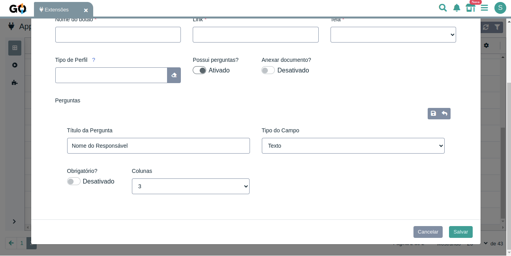

  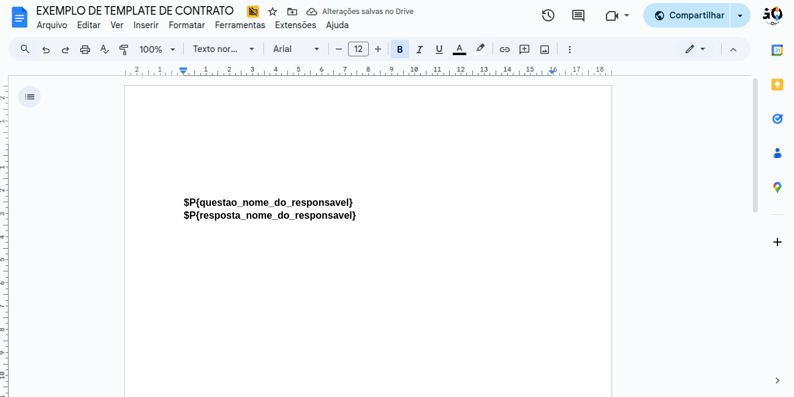

## Solução de Problemas

### Erro: "Documento não encontrado"

* Verifique se o link do Google Docs está correto  
* Confirme que o documento tem permissão pública ou compartilhada

### Erro: "Timeout ao acessar documento"

* Documento muito grande  
* Conexão lenta com o Google Docs  
* Tente novamente em alguns minutos

### Variáveis não são substituídas

* Confirme a sintaxe: `$P{nome_da_variavel}`  
* Verifique se a variável existe para a entidade  
  
