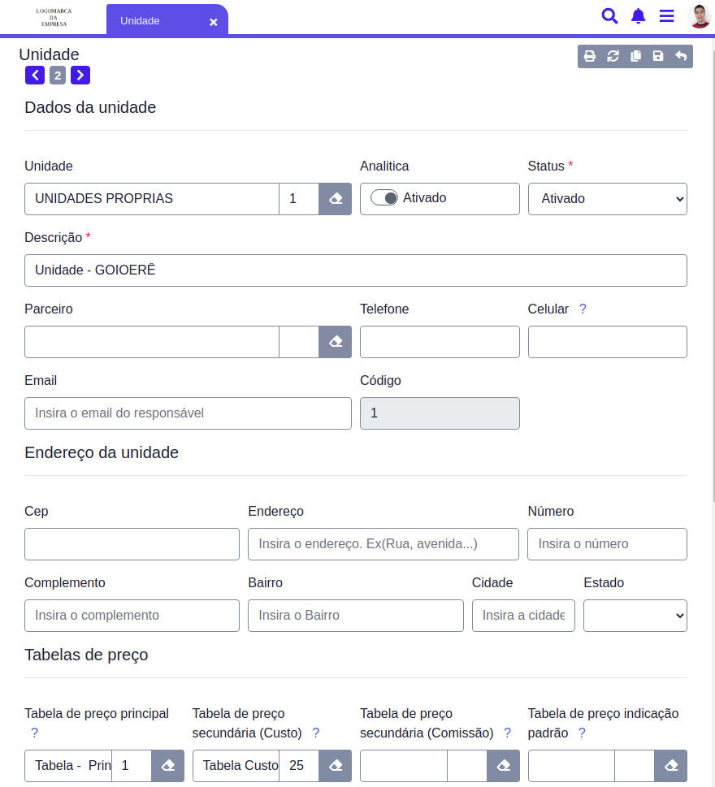
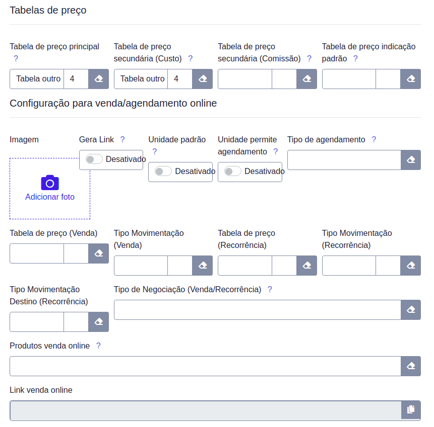

# Cadastro de Unidade

As unidades são fundamentais para o funcionamento do sistema, através delas são definidas as tabelas de preço utilizadas pelos vendedores, o ecommerce de acordo com o plano adotado pelo cliente ou até mesmo o pré pago caso esteja incluída em algum contrato.

Para adicionar uma nova unidade no Gestão Online é simples, pesquise pela página **Unidades** clicando sobre o ícone de pesquisa.

Ao abrir a página, uma lista de unidades será carregada, selecione a qual deseja editar ou adicione uma nova clicando sobre o ícone de _Adicionar Item_.

Um formulário será aberto solicitando as informações da unidade. Após preencher os dados básicos como descrição e endereço, você pode definir como os itens serão precificados para a realização de vendas nessa unidade.

Dentre as tabelas definidas na unidade temos:

* **Tabela principal**: Usada para ajustar o preço final ao cliente em cada item.
* **Tabela secundária de custo**: Utilizada pela unidade para registrar o gasto que ela teve com sua sede no modelo _multiunidades_.
* **Tabela de comissão**: Uma sede pode utilizar esta tabela como forma de registro sobre cada venda feita por uma unidade qualquer, em que a sede recebe o dinheiro.
* **Tabela de indicações padrão**: Caso o parceiro indicador não possua uma tabela de indicações, o sistema utilizará esta tabela para comissioná-lo.

Você pode cadastrar cada uma dessas tabelas através do nosso guia sobre **tabelas de preço** clicando [aqui](cadastro_unidade.md).

## Configuração do ecommerce através da Unidade

No sistema Gestão Online, caso o seu plano possua o serviço de ecommerce, você pode definir qual tabela de preço será utilizada para definir os itens no site, ou até mesmo gerar um ecommerce específico para cada unidade.

Para isso, precisamos definir algumas regras para o ecommerce de uma unidade em específico:

* A sua tabela de preços
* O tipo de movimentação utilizado para gerar a venda no sistema
* Ativar as opções de Unidade Padrão e Geração de Links
* Os tipos de negociação utilizados \(recomendamos que escolha BOLETO e CARTAO com o vínculo a GOPAG\) para receber os pagamentos.

Pronto apartir de agora você poderá acessar o seu site de vendas online através da url suaempresa.gestao.plus/loja ou através do _link de venda online_ gerado pela unidade caso a opção `Gera Link` estiver ativa.

