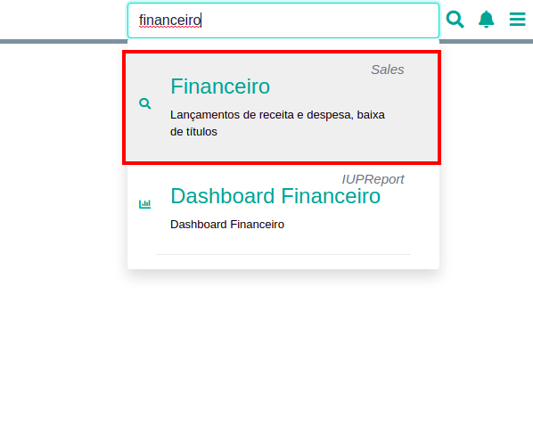
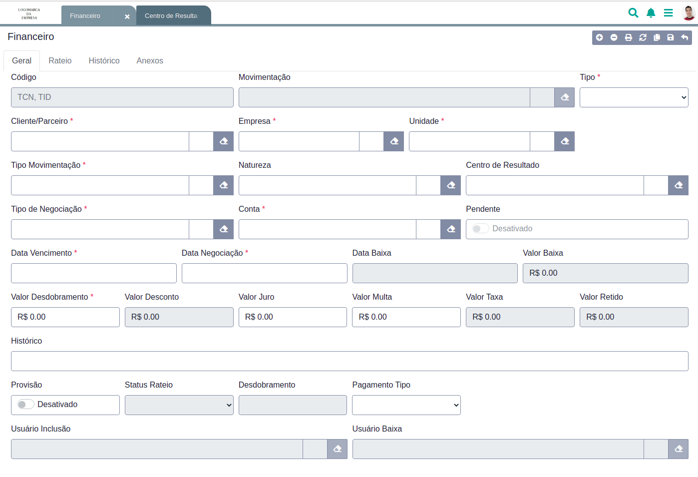
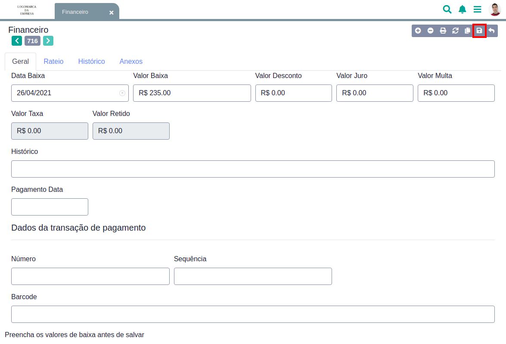

# Financeiro

Com o módulo financeiro do Gestão Online você tem controle total das suas contas a pagar e receber, relatórios, um fluxo de caixa organizado e flexibilidade para gerenciar suas movimentações.

## Cadastrar Entrada no Financeiro

Para gerenciar suas entradas no financeiro pesquise pela página **`Financeiro`**.

Uma lista será carregada descrevendo os detalhes de cada entrada. Para adicionar uma nova conta, clique em adicionar item no menu superior direito.

Um formulário será aberto solicitando os detalhes da conta a ser registrada.

Os seguintes campos precisam ser preenchidos.

* O `Tipo` da conta se será uma receita ou despesa. \*
* O cliente relacionado a essa movimentação.
* A empresa responsável.
* Unidade em que foi realizada essa entrada
* O tipo de movimentação utilizado.
* Tipo de negociação (forma de pagamento)
* Conta (conta bancária)
* Data Negociação (data de início da fatura)
* Data de Vencimento da fatura
* Valor do desdobramento (quantia a ser paga ou recebida)

Os demais campos são opcionais:

- A natureza da conta, categorizando o tipo da receita ou despesa, por exemplo \(despesas com viagem, serviços, receitas administrativas), este campo é muito útil para a realização do plano de contas de sua empresa, em que os gastos ou receitas ficam divididos por gategorias, lembrando que o plano de contas também é utilizado na elaboração do Orçamento Empresarial.
- Centro de resultado, este é responsável pela divisão dos setores da empresa (ADMINISTRATIVO, MARKETING, SÓCIOS, PARCEIROS, COMERCIAL...), o centro de resultado pode ser definido durante o cadastro do vendedor.
- Valores de juro e multa
- Histórico (observações para conta)

## Controle de contas

Você também pode anexar suas faturas através da aba **`anexos`**, para isso ao editar uma conta, selecione a aba e clique em **Adicionar Item**,

## Como realizar a baixa de alguma conta?

Para realizar a baixa manual de alguma conta no financeiro, selecione a opção **`Baixar`** no menu superior direito dentro da conta em análise.

Informe a data em que houve o recebimento, os valores \(descontos, juros, multas\) e depois clique em salvar.

Pronto! Apartir de agora, caso a conta esteja relacionada á alguma venda, o seu status financeiro será atualizado.

## Como realizar o estorno de alguma conta?

Para realizar o estorno de alguma conta, selecione a opção **`Estornar`** no menu superior direito dentro da conta em análise.

Um alerta será mostrado, clique em 'ok' e pronto, sua conta foi estornada, o valor de baixa será zerado e o status financeiro da venda voltará a ser azul.

## Como gerar relatórios sobre o financeiro?

Primeiramente, selecione o tipo de relatório que deseja gerar, dentre eles temos:
- **contas a receber**
- **contas a pagar**
- **fluxo de caixa**
- **fluxo de caixa a pagar**
- **listagem de lançamentos**

**Obs:** Você poderá adicionar mais relatórios em seu sistema através da página **Reports and Widgets Builder**. 

Após selecionar o relatório desejado, escolha o período e as opções de filtragem para a sua geração, após isso basta clicar em "**Gerar Relatório**", um documento será gerado com as informações solicitadas, assim fica fácil controlar o financeiro de sua empresa.

Um relatório de contas a receber gerado como pdf terá a seguinte estrutura:

