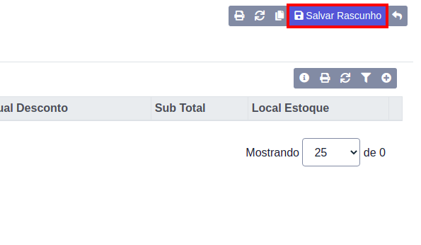
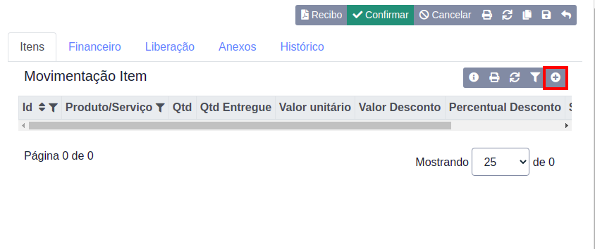
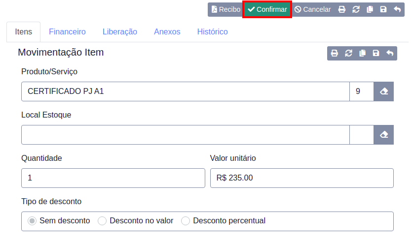
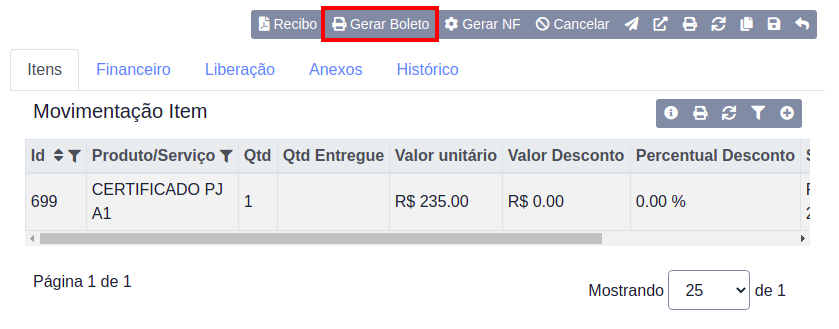
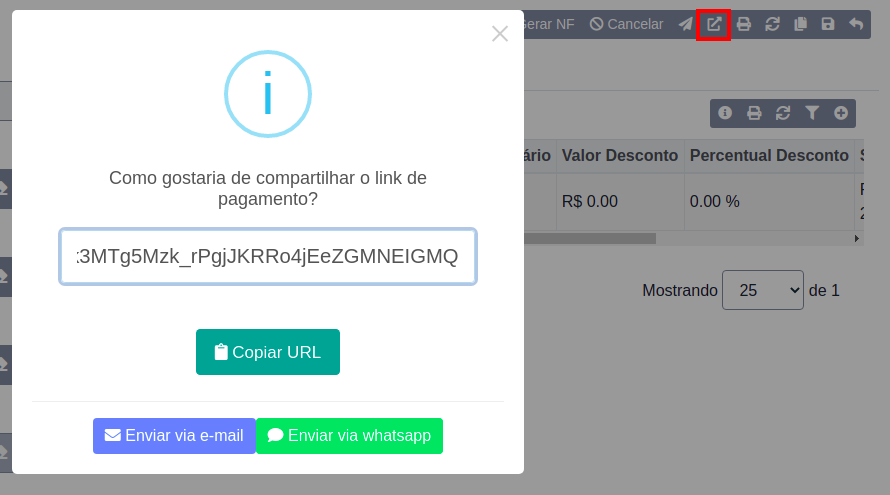
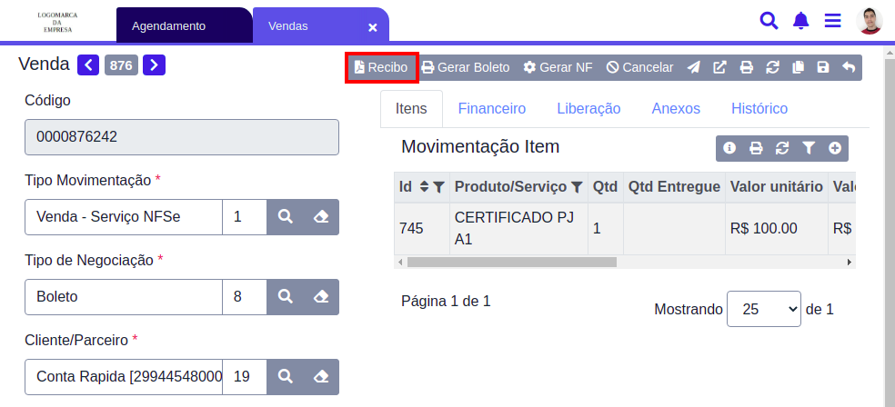

# Vendas

## Vendas

Cadastrar uma nova venda pelo Gestão Online é fácil, através dela é possível gerar boletos e emitir notas fiscais. Assim que uma venda é confirmada o estoque e financeiro são atualizados automaticamente.

Antes de cadastrar uma venda, a [empresa](venda.md), [cliente](venda.md), [produtos](venda.md) e [tabela de preço](venda.md) correspondente devem estar previamente cadastrados.

Pesquise pela página **`Vendas`**, após abrir, clique em "adicionar item" para realizar uma nova venda.

### Realizando Venda

Para que a venda seja realizada, primeiramente deve\_se preencher somente os seguintes campos:

* * Tipo de Negociação:

    Aqui escolhemos a forma de pagamento \(boleto, cartão, dinheiro\).
* * Cliente cadastrado
* * Tipo de Movimentação: Determina o comportamento da venda, se atualiza estoque, altera financeiro, faz parte do pré pago.

Após completar os campos, no menu principal da página clique em _`Salvar Rascunho`_

**Os outros campos serão preenchidos automaticamente após salvar rascunho.**

### Adicionando itens à venda

Após salvar o rascunho de sua venda, clique em _`adicionar item`_ no menu de opções secundário dentro da aba itens.

Complete os campos relacionados ao item:

* Produto/serviço: Digite qual certificado deseja vender, ao selecioná\_lo o sistema puxa automaticamente o valor de acordo com a 'tabela de preço' cadastrada no vendedor que esta realizando a venda,
* Quantidade: Escolha a quantidade de certificados, mesmo sendo mais de '1' certificado o valor exibido será referente a '1' unidade.
* Caso o 'Produto/serviço' seja um \_KIT: Ao selecionar o KIT, será puxado pelo sistema o '\_local de estoque' que está cadastrado no vendedor, onde então, de forma automática, vai ser descontado a quantidade de 'Token, SmartCard ou Leitora'  de acordo com a quantidade selecionada.
* Se deseja adicionar um desconto ao 'produto/serviço' do seu cliente, selecione o desconto em percentual ou em valor.  O valor ou percentual selecionado será descontado de cima de cada certificado.
* Em seguida clique em ''salvar'' para gravar a venda.

### Solicitando desconto

Caso o desconto adicionado pelo vendedor seja maior que o seu perfil de desconto, uma nova entrada será criada em liberações após a tentativa de confirmação da venda e um aviso irá informar que a venda não pode ser confirmada.

Apartir de agora, um gestor deve liberar a solicitação de desconto para que a venda seja confirmada.


**Cuidado**: Os valores de uma venda assim como o seu desconto não podem ser alterados após a sua liberação/confirmação. Estes dados podem ser modificados enquanto a venda for um rascunho.


* Depois clique em **confirmar**. Pronto sua venda está feita, dependendo das configurações e integrações um código é gerado automaticamente e após a confirmação também é possível gerar boleto, notas fiscais e o link de pagamento.

### Geração de Boletos

* Clique em `gerar boleto` em seguida `emitir boletos`, o boleto gerado irá para aba `anexos`.

### Links de Pagamento

Através do Gestão Online também é possível gerar links de pagamento após as vendas, oferecendo comodidade e praticidade aos seus clientes.

* Caso a movimentação tenha sido realizada por boleto ou cartão o link de pagamento pode ser gerado através deste botão.

Após acessar o link, o cliente terá acesso ao resumo da venda e a meio de pagamento escolhido.

O financeiro será baixado automaticamente caso a venda tenha sido realizada utilizando o 'Tipo de negociação': Boleto ou Cartão. Caso não possua o Go\_pag, o seu Banco devera ter integração com o Gestão.Online para que essa baixa seja automática. Sem a integração do banco no Gestão Online, pagamentos em dinheiro, maquininha física, PIX ou outra forma de pagamento sem vínculo com o sistema, devem ter a baixa feita manualmente.

Para realizar uma baixa ou estorno de algum pagamento confira nosso [guia](financeiro.md) sobre o financeiro.

## Recibos

Para que um comprovante de pagamento seja gerado, escolha a opção **Recibos** no menu superior, um pdf será gerado com o resumo da compra.

### Cancelar uma venda

Com alguns cliques você será capaz de cancelar sua venda, para isso certifique\_se que não há movimentações fiscais ou baixas no financeiro referente a essa venda, caso haja alguma realize o seu estorno.

* Clique em 'cancelar' em seguida escreva o motivo do cancelamento.

### O boleto venceu e o cliente não pagou e agora?

Para gerar novos boletos é fácil selecione a aba `Financeiro` na página da venda aberta.

Clique em editar a conta, caso ela ainda não tenha baixa financeira e altere a data de vencimento para outra qualquer, após isso basta clicar em `Salvar` e depois gerar o boleto novamente.

### Notas Fiscais

Para gerar a nota fiscal para venda, utilize um tipo de movimentação com a opção _Gera Fiscal_ ativa, após isso ao confirmar a venda o botão **`Gera NF`** estará disponível, selecione\_o para que o pdf e xml sejam gerados, você pode baixá\_los através da aba **Anexos**.

