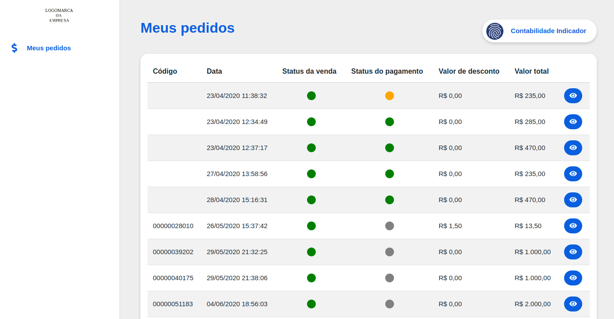
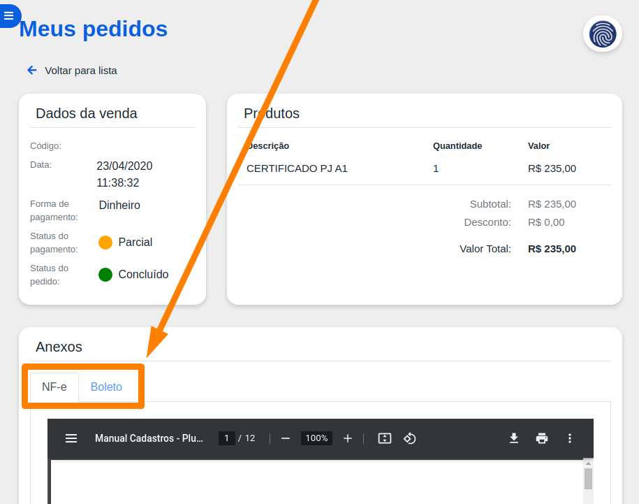

# 💰 Modo Cliente


 Este Portal de acesso do cliente é contratado a parte pelo [Marketplace](/erp-v2/marketplace/inicio.md) do Gestão Online, entre em contato com o nosso time [Comercial](https://api.whatsapp.com/send?phone=556237735650&text=Ol%C3%A1%20gostaria%20de%20mais%20informa%C3%A7%C3%B5es%20sobre%20o%20marketplace%20do%20Gest%C3%A3o.Online) para maiores informações.


Com o modo cliente você conseguirá acompanhar o status de suas compras e verificar todas as suas informações.

Para visualizar o resumo de uma compra, assim como os arquivos associados a ela \(nota, boletos\), selecione o ícone azul ao lado da compra.

