# 🤝 Modo Indicador


 Este Portal do Indicador é contratada a parte pelo [Marketplace](/erp-v2/marketplace/inicio.md) do Gestão Online, entre em contato com o nosso time [Comercial](https://api.whatsapp.com/send?phone=556237735650&text=Ol%C3%A1%20gostaria%20de%20mais%20informa%C3%A7%C3%B5es%20sobre%20o%20marketplace%20do%20Gest%C3%A3o.Online) para maiores informações.


Neste modo você conseguirá:

* Acompanhar o status de todas as suas indicações através de um dashboard organizado.
* Realizar uma única indicação ou adicionar novas através de uma importação de listas dinâmica.
* Consultar ou remover indicações anteriores apartir de uma listagem completa.
* Consultar os seus ganhos totais.

## Dashboard do Indicador

Este espaço oferece uma visão abrangente das indicações realizadas, seja por você ou pelo seu parceiro indicador. Os gráficos apresentados fornecem dados detalhados e organizados para facilitar o acompanhamento do desempenho e das tendências relacionadas às suas indicações.

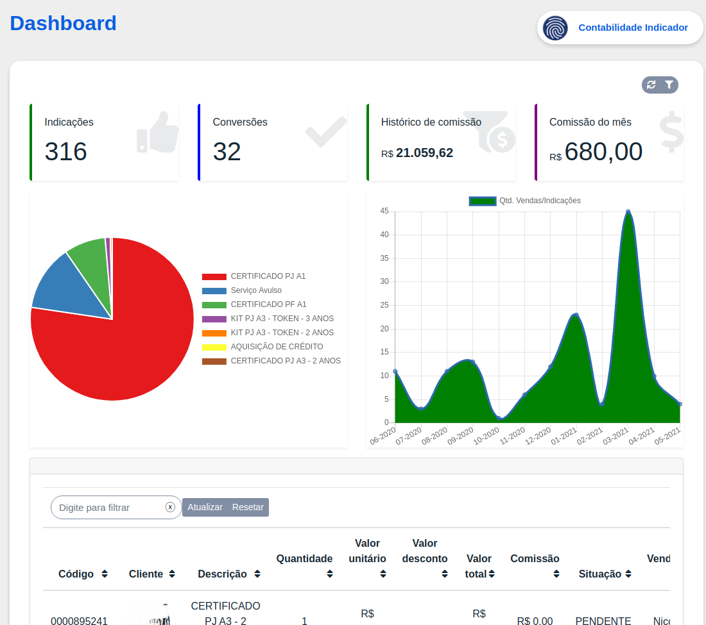

### Funcionalidades do Dashboard

**Detalhamento Interativo** 

Passe o cursor sobre os gráficos para visualizar informações adicionais, como:
- Quantidade específica de produtos ou serviços indicados.
- Número total de indicações em diferentes períodos de tempo.
- Comparativos entre indicações realizadas por você e pelo parceiro indicador, quando aplicável.

**Análise Temporal** 

Visualize tendências ao longo do tempo, identifique picos de atividade e monitore o impacto das suas indicações em diferentes intervalos.

**Personalização** 

Configure filtros para ajustar os períodos exibidos, tipos de indicação ou categorias específicas de produtos e serviços.

Observando mais abaixo ainda na tela inicial é mostrado a você uma listagem com todas as indicações já realizadas.


**Dica**: É possível selecionar o período que deseja visualizar no dashboard através do ícone de filtragem no canto superior direito.


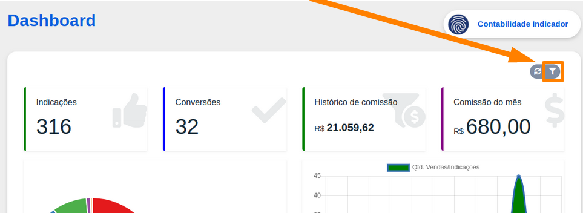

## 💰🤝 Minhas Vendas Indicadas

Este Menu permite a visualização da lista de Vendas Indicadas. Para cada registro, são disponibilizadas as seguintes informações: dados do indicado, produto comercializado, valor da venda, status do pedido, status do pagamento e acesso ao boleto da venda.”

Clicando no menu, irá listar as vendas registradas que está como Parceiro indicador.

Ao acionar o ícone de visualização **(ícone de olho)** localizado na extremidade direita de cada registro, o sistema direciona para a tela de detalhes da venda, onde são disponibilizados os seguintes dados:

* Informações do produto comercializado
* Dados do cliente
* Status do pedido
* Status do pagamento
* Valores de indicação

Rolando a página para baixo quando a **Forma de pagamento for Boleto**, o sistema exibirá o respectivo documento para visualização e/ou download.

Dentro da venda tem o botão **Ver resumo**, o sistema abrirá uma nova aba contendo o resumo consolidado da transação, incluindo informações de compra e pagamento.

## Minhas Indicações

Aqui é possível verificar uma lista completa com todos os indicados, inclusive adicionar ou removê-los. Para adicionar um cliente clique em **`Nova Indicação`** ou caso queira adicionar vários clientes de uma só vez, pode utilizar o botão **`Importar Lista`**.

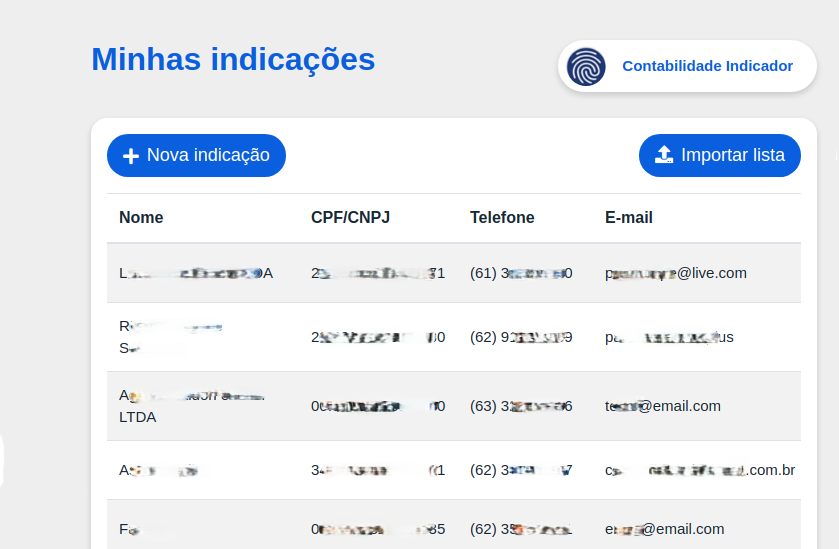

Clicando no botão **`Nova Indicação`**, um formulário será aberto para você solicitando as informações do novo cliente que será cadastrado.

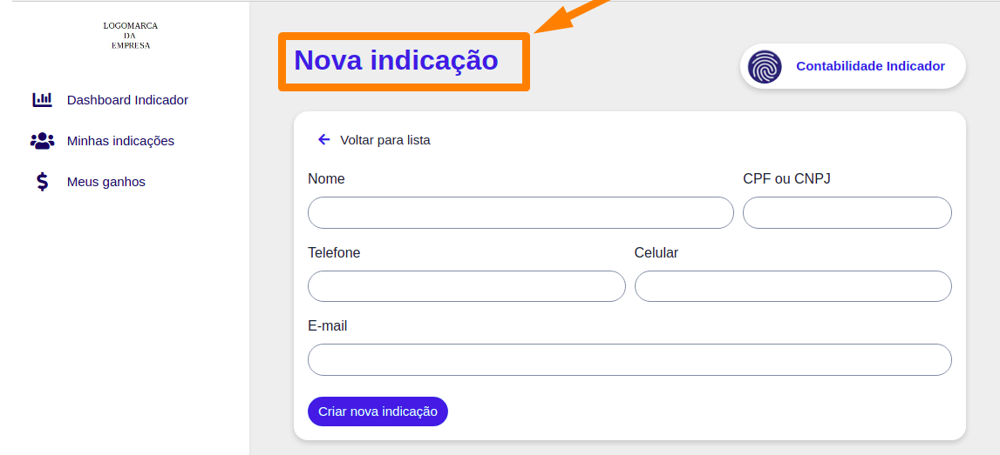

Agora clicando no botão  **`Importar uma lista`**, uma janela pop-up será mostrada a você, mostrnado os campos necessários para a importação e o botão para você importar a planilha com as informações.

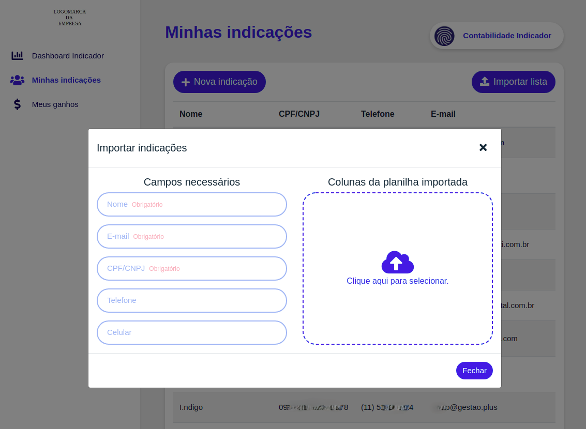

Selecione o arquivo no formato de planilha que deseja importar. Assim que o arquivo for adicionado, suas colunas serão exibidas, permitindo que você defina a correspondência entre os dados a serem importados e as informações presentes no arquivo.

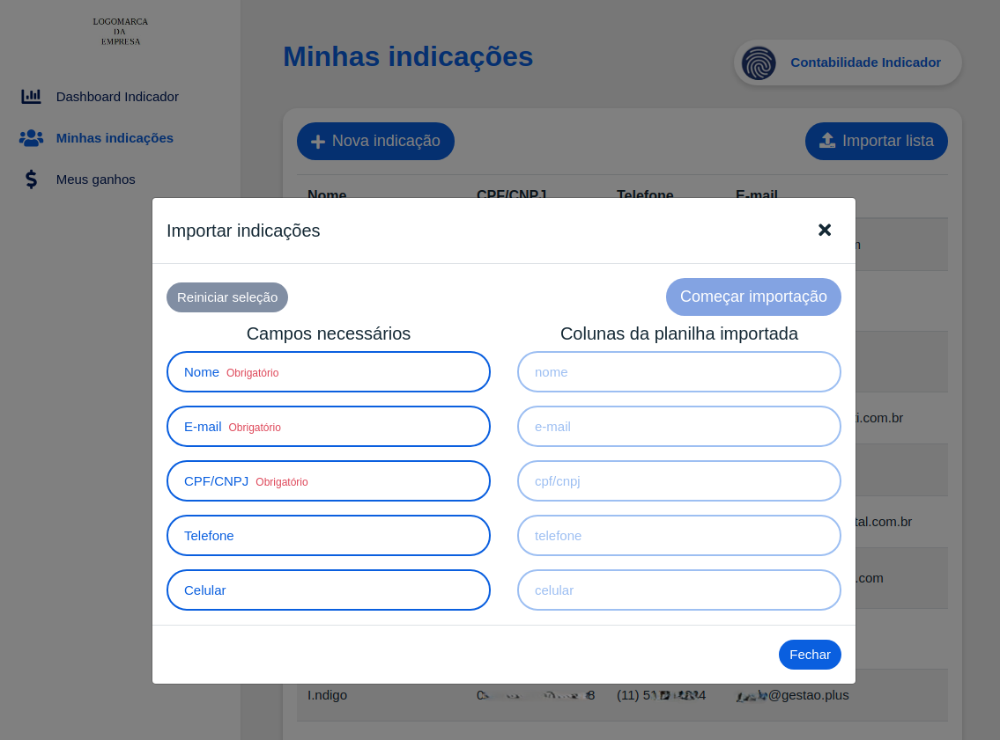

Após selecionar a correspondecia entre as colunas clique em "**Começar Importação**" e o sistema fará o processo de adicionar os indicadores um a um.

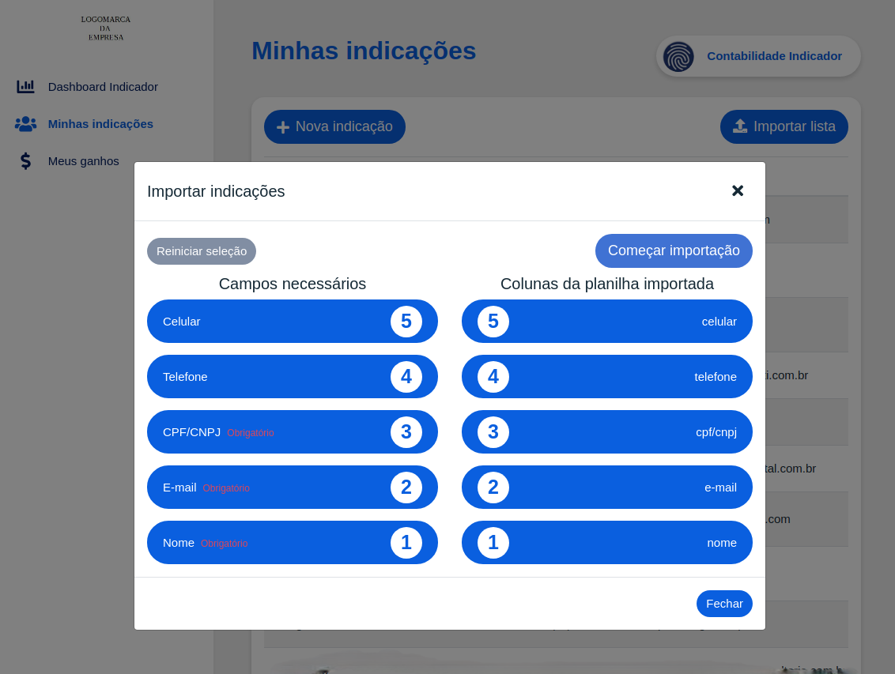

Durante a importação um detalhamento será gerado com os dados de cada indicador que você está importando, podendo ser um status de sucesso ou falha. É importante verificar os que tiverem alguma falha e corrigir o possível erro, ou adicionar esse indicador de forma manual, conforme mostrado abaixo.

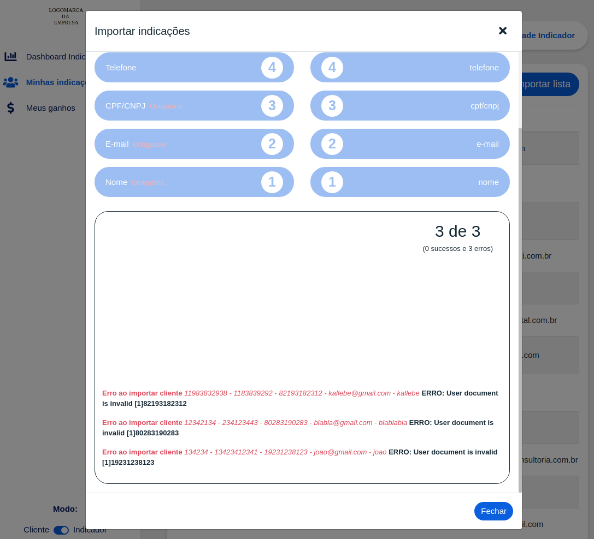

Após finalizar a importação, os novos indicadores estarão disponíveis na lista e cadastrados como clientes no sistema.

## Informações do Parceiro Indicador

No modo indicador é possível visualizar os dados clicando sobre o ícone do perfil e selecionando a opção **Minha Conta**, após selecionada um menu será aberto com todos os dados.

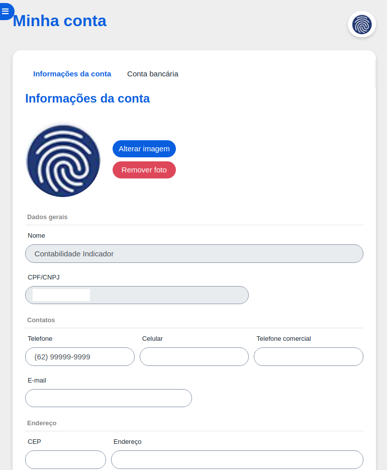

Você também pode visualizar os seus dados bancários para recebimento das comissões através da opção **`Conta Bancária`**.

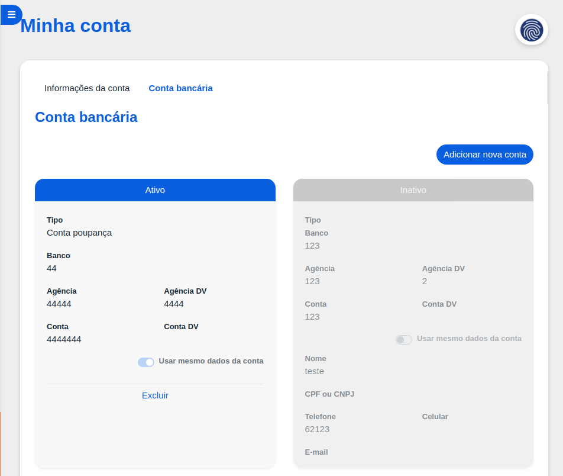

Caso queira adicionar uma nova conta selecione a opção **Adicionar nova conta**. Um formulário será aberto solicitando as informações da conta.

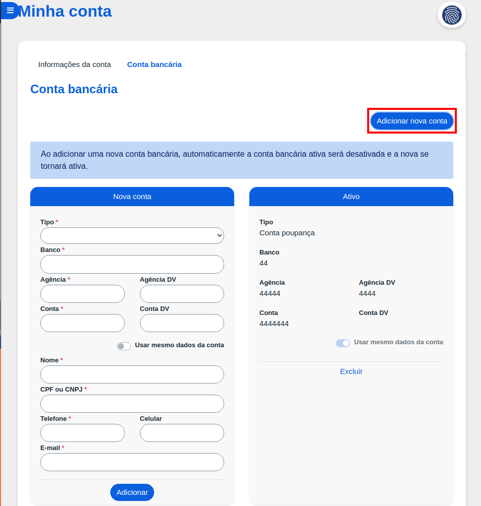

Preencha os dados da sua conta e clique em _Adicionar_ e pronto sua conta para receber suas **comissões** foi cadastrada.

